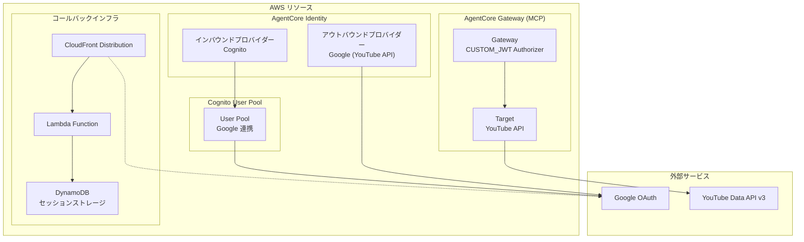
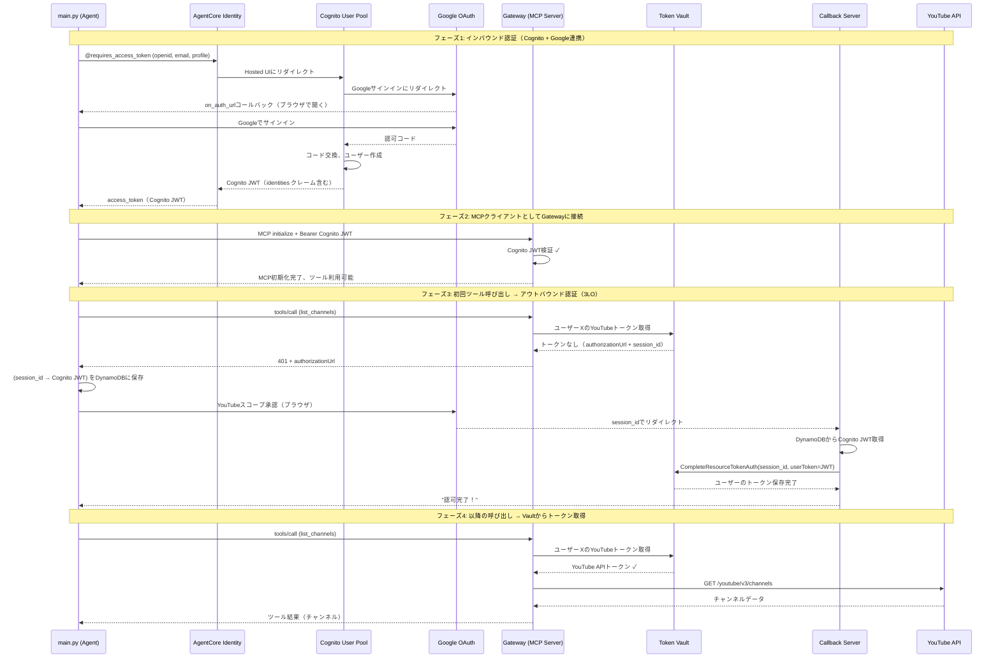
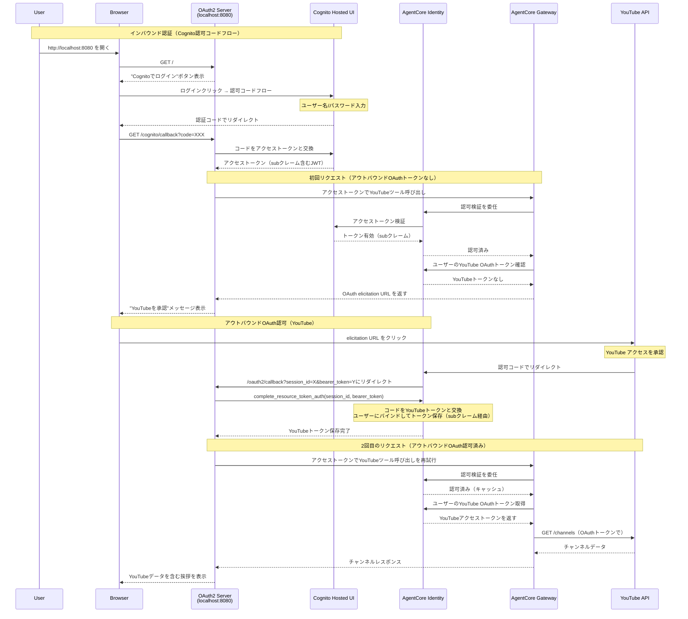
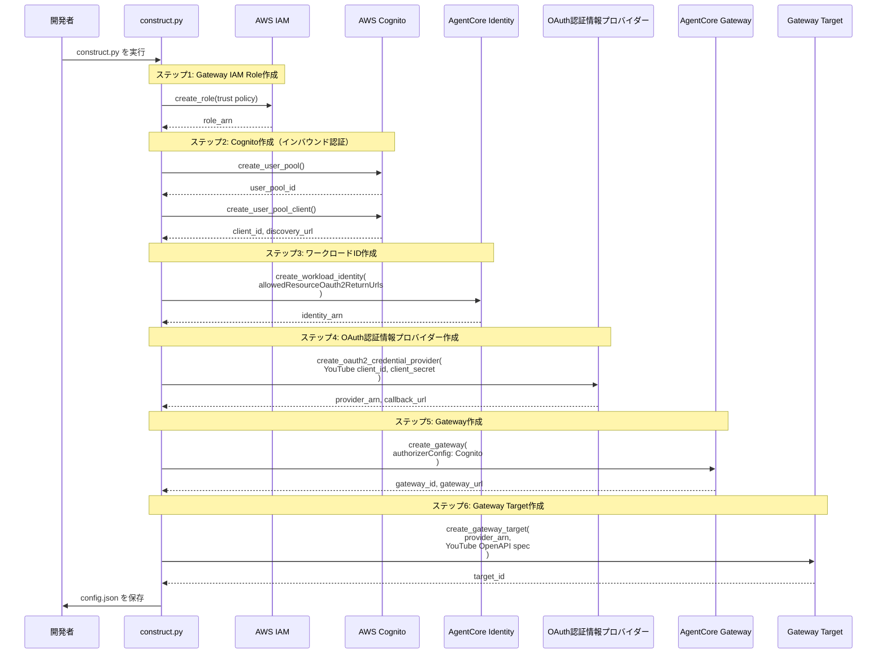

# AWS Bedrock AgentCoreによるOAuth統合の実践ガイド

## 目次

1. [概要](#概要)
2. [リポジトリの特徴](#リポジトリの特徴)
3. [主要プロジェクト](#主要プロジェクト)
4. [アーキテクチャコンセプト](#アーキテクチャコンセプト)
5. [技術スタック](#技術スタック)
6. [ユースケースと実用例](#ユースケースと実用例)
7. [セットアップ要件](#セットアップ要件)
8. [開発者向けガイド](#開発者向けガイド)

---

## 概要

**agentcore-in-action**は、Amazon Bedrock AgentCoreを使用したOAuth統合の実践的な例を提供するリポジトリです。Jupyter Notebookによる段階的な学習例は機能の理解に役立ちますが、既存のアプリケーションへの統合には課題があります。本リポジトリは、この gap を埋めるために、本番環境を意識した実行可能なスクリプトベースの実装例を提供します。

### リポジトリの目的

- **探索から統合への橋渡し**: Notebookから実運用への移行を容易にする
- **再現可能なワークフロー**: `uv`による依存関係管理で、クローン後すぐに実行可能
- **セキュリティ重視**: 本番環境でのセキュリティ考慮事項を各例で文書化
- **仕様主導**: 仕様から設計し、テストを満たす実装を提供

---

## リポジトリの特徴

### 明確性
各例は包括的なドキュメントを備えた自己完結型のプロジェクトです。

### 再現性
- `uv`による依存関係管理
- リポジトリクローン後すぐに動作
- 明確なエラーメッセージと設定手順

### セキュリティ
- 認証情報管理のベストプラクティス
- 入力検証とサニタイゼーション
- レート制限とスロットリング
- IAM最小権限の原則

### 仕様主導開発
1. **仕様定義**: README.mdで期待動作を定義
2. **テスト設計**: 仕様に基づいた実行可能なテスト作成
3. **実装**: テストを満たす最小限のコード実装
4. **検証**: セキュリティチェック、ドキュメント、トラブルシューティング

---

## 主要プロジェクト

### 1. oauth-gateway-from-agent: エージェントからのOAuthゲートウェイ

**概要**

認証されたユーザーに代わってサードパーティAPIにアクセスするセキュアなMCPサーバーの構築例です。このプロジェクトは、**インバウンドOAuth認証**（ユーザーID）と**アウトバウンドOAuth認可**（API アクセス）の両方を実装しています。

#### 主な機能

- **インバウンド認証**: GoogleOAuthを通じた Cognito経由のユーザー認証
  - ユーザーが誰であるかを特定（WHO）
  - CognitoがGoogleサインインをフェデレーション
  - GatewayのCUSTOM_JWT認証によりJWT検証

- **アウトバウンド認可**: Token Vault経由のYouTube API アクセス
  - ユーザーが何にアクセスできるかを制御（WHAT）
  - OAuth 2.0 認可コードグラント（3レッグOAuth）
  - ユーザーごとのトークン隔離と安全な保存

#### なぜCognitoが必要か？

AgentCore Identityプロバイダーには異なる機能があります：

| プロバイダー | インバウンド（ユーザーID） | アウトバウンド（APIアクセス） |
|------------|------------------------|------------------------|
| **Google** | ❌ サポートなし | ✅ サポートあり |
| **Cognito** | ✅ サポートあり | ✅ サポートあり |

GoogleのOAuthプロバイダーはアウトバウンドリソースアクセス専用で、インバウンドユーザー認証には使用できません。

**解決策**: CognitoとGoogle連携により、インバウンド認証にGoogleサインインを使用しながら、アウトバウンドトークン検索のためにGoogle ユーザーIDを保持できます。

#### アーキテクチャ



#### 実行フロー



#### 主要コンポーネント

**1. Cognito User Pool（Google連携）**
- Googleサインインをフェデレーション
- `identities`クレームを含むJWT発行
- OAuth フロー: 認可コード
- スコープ: `openid`, `email`, `profile`

**2. AgentCore Gateway（MCPサーバー）**
- インバウンド: Cognito JWTの検証
- ワークロードID: Gatewayのアプリケーション識別子
- アウトバウンド: Token Vaultからユーザーのトークン取得

**3. OAuth コールバックサーバー（CloudFront + Lambda）**
- CloudFront Distribution: DDoS保護を備えた公開エンドポイント
- Lambda Function: OAuthコールバックを処理し、セッションバインディングを完了
- DynamoDB Table: 自動クリーンアップのTTL付きセッションデータ保存

**セッションバインディングが必要な理由:**
- セッションハイジャック防止
- `(session_id → user_jwt)` をDynamoDBに保存
- OAuth フローを開始したユーザーのみが完了できることを保証

#### 実装例

```python
from bedrock_agentcore.identity import requires_access_token
from mcp.client.streamable_http import streamablehttp_client
from strands import Agent
from strands.tools.mcp import MCPClient

@requires_access_token(
    provider_name=INBOUND_PROVIDER_NAME,
    scopes=["openid", "email", "profile"],
    auth_flow="USER_FEDERATION",
    on_auth_url=lambda url: webbrowser.open(url),
)
def run_agent(*, access_token: str):
    """Gatewayを MCPサーバーとしてエージェントを実行。
    
    access_tokenは、以下を含むCognito JWT（Google連携）：
    - sub: Cognito ユーザーID
    - identities: [{"providerName": "Google", "userId": "<google_user_id>"}]
    """
    mcp_client = MCPClient(
        lambda: streamablehttp_client(
            GATEWAY_ENDPOINT,
            headers={"Authorization": f"Bearer {access_token}"}
        )
    )
    with mcp_client:
        tools = mcp_client.list_tools_sync()
        agent = Agent(tools=tools)
        response = agent("YouTubeチャンネルをリスト表示")
        print(response)
```

#### セキュリティ考慮事項

- **トークン隔離**: 各ユーザーのGoogleトークンをToken Vaultで個別に保存
- **ID バインディング**: JWT の`sub`クレームに基づくトークン取得
- **スコープ分離**: インバウンド（ID）とアウトバウンド（API）で異なるスコープ使用
- **トークン非公開**: Google API トークンをクライアントに送信しない
- **KMS暗号化**: DynamoDBのトークンストレージをKMSで暗号化


---

### 2. oauth-gateway-from-browser: ブラウザからのOAuthゲートウェイ

**概要**

OAuth 2.0 認可コードグラント（3レッグOAuth）を使用して、ユーザーのYouTubeデータに基づいたパーソナライズされたメッセージでユーザーに挨拶するエージェントの構築例です。

#### 主な機能

- **ブラウザベースのOAuthフロー**: Cognito Hosted UIを通じたユーザー認証
- **デュアルOAuthフロー**: 
  1. Cognito認可コードフロー（インバウンド）: カスタムスコープを含むアクセストークン取得
  2. YouTube OAuthフロー（アウトバウンド）: API呼び出し用のYouTubeアクセストークン取得
- **ユーザー委任アクセス**: エージェントがユーザーの認証情報を見ることなく外部APIにアクセス
- **セキュアなトークン管理**: AgentCore Identityによるユーザーごとのトークンバインディング

#### アーキテクチャ



#### 重要な概念

**2つの独立したOAuthフロー:**

1. **Cognito認可コードフロー（インバウンド）**:
   - スコープ: `openid`, `youtube-gateway-resources/youtube-target`
   - 目的: Gatewayにアクセスするためのアクセストークン取得
   - `sub`クレームがユーザーを一意に識別

2. **YouTube OAuthフロー（アウトバウンド）**:
   - スコープ: `https://www.googleapis.com/auth/youtube.readonly`
   - 目的: API呼び出し用のYouTubeアクセストークン取得
   - `sub`クレームを介してユーザーにバインド

**カスタムスコープが必要な理由:**

Gatewayは、アウトバウンド認証にOAuth認証情報プロバイダーを使用する際、JWTに`youtube-gateway-resources/youtube-target`スコープが必要です。

#### 構築プロセス



#### 実装例

**エージェントコア（agent.py）**

```python
def call_gateway_tool(gateway_url, bearer_token, tool_name, arguments):
    headers = {
        "Content-Type": "application/json",
        "Authorization": f"Bearer {bearer_token}",
        "MCP-Protocol-Version": "2025-11-25"  # OAuth elicitationに必要
    }
    
    payload = {
        "jsonrpc": "2.0",
        "id": 1,
        "method": "tools/call",
        "params": {
            "name": tool_name,
            "arguments": arguments
            # ⚠️ _metaフィールドなし - ELB 403エラーの原因となる
        }
    }
    
    response = requests.post(gateway_url, headers=headers, json=payload)
    return response.json()
```

**なぜ生のJSON-RPC?**

Strands MCPクライアントはプロトコルバージョン`2025-03-26`を使用しますが、これはOAuth URL elicitationをサポートしていません。バージョン`2025-11-25`が必要です。

**OAuth2コールバックサーバー（oauth2_callback_server.py）**

```python
class OAuth2CallbackServer:
    def __init__(self, region, config):
        self.app = FastAPI()
        self.identity_client = boto3.client("bedrock-agentcore", region_name=region)
        self.access_token = None  # Cognito認証後に保存
        
    def _handle_cognito_callback(self, code):
        # 認証コードをアクセストークンと交換
        access_token = exchange_code_for_token(code)
        self.access_token = access_token
        
        # YouTube OAuth elicitationをトリガー
        result = call_gateway_tool(...)
        if "error" in result:
            auth_url = extract_elicitation_url(result)
            return display_auth_url(auth_url)
    
    def _handle_youtube_callback(self, session_id, bearer_token):
        # YouTube OAuthを完了
        self.identity_client.complete_resource_token_auth(
            sessionId=session_id,
            userToken=bearer_token
        )
        # 保存されたアクセストークンでGateway呼び出しを再試行
        return greet_user(self.access_token)
```

#### クイックスタート

```bash
cd oauth-gateway-from-browser

# 環境変数をコピー
cp .env.example .env

# AgentCoreコンポーネントを構築
uv run python construct.py

# Cognitoユーザーを作成（初回のみ）
uv run python main.py --signup --username myuser --password MyPass123!

# デモを実行
uv run python main.py
```

#### セキュリティ考慮事項

**認証情報管理:**
- 認証情報をハードコードしない
- AWS Secrets Managerまたは環境変数を使用
- OAuth シークレットの定期的なローテーション

**コールバックURLのベアラートークン:**
- 本番環境ではHTTPSが必須（bearer_tokenがクエリパラメータで渡される）
- ログからクエリパラメータを除外
- ステートレス設計により、同時OAuth フロー での競合状態を排除

**入力検証:**
- OAuthの state を検証してCSRF攻撃を防止
- ユーザー入力のサニタイゼーション
- JWT検証はAgentCore Identityが自動的に実行

---

## アーキテクチャコンセプト

### AgentCore Gateway

AgentCore Gatewayは、エージェントと外部APIを橋渡しする**MCPサーバー**として機能し、認証と認可を組み込みで提供します。

#### Gatewayの役割

```
┌─────────────────────────────────────────────────────────────────────┐
│                      AgentCore Gateway                              │
├─────────────────────────────────────────────────────────────────────┤
│                                                                     │
│  1. インバウンド認証: "このユーザーは誰か？"                          │
│     - CognitoからのJWTを検証（CUSTOM_JWT authorizer）               │
│     - ユーザーIDを抽出（subクレーム、identitiesクレーム）            │
│                                                                     │
│  2. ワークロードID: "このアプリケーションは何か？"                    │
│     - GatewayはAgentCore内に独自のIDを持つ                          │
│     - ユーザートークンのスコープ: (Gateway + User) → 一意のトークン  │
│     - OAuthフロー用の信頼されたコールバックURLを定義                  │
│                                                                     │
│  3. アウトバウンド認証: "このユーザーは何にアクセスできるか？"         │
│     - Token VaultからユーザーのAPIトークンを取得                     │
│     - トークンが見つからない場合はOAuthフローをトリガー（elicitation）│
│     - 外部APIへのリクエストにトークンを注入                           │
│                                                                     │
└─────────────────────────────────────────────────────────────────────┘
```

#### ワークロードIDとは

Gatewayを作成すると、AgentCoreは自動的に**ワークロードID**を作成します。これは、AgentCoreの世界におけるGatewayの「企業ID」と考えてください：

```
ワークロードID = "mcp-oauth-gateway-gateway-xyz"
        │
        ├── このGatewayアプリケーションを表す
        │
        ├── Token Vaultのエントリは（ワークロードID + ユーザー）にスコープされる
        │   └── 異なるGateway を通じた同じユーザー = 別々のトークン
        │
        └── allowedResourceOauth2ReturnUrls
            └── OAuthセッションバインディング用の信頼されたコールバックURL
```

**なぜワークロードIDがOAuthに重要か:**

企業が従業員のリクエストを処理するようなものと考えてください：

```
ワークロードID = "Acme Corp Gateway"（会社）
ユーザー（JWT）= IDバッジを持つ従業員
Token Vault    = セキュアなファイリングキャビネット
session_id     = リクエストフォーム番号

シナリオ: 従業員BがYouTube APIアクセスを必要とする

1. 従業員B（JWT）がAcme Corp ビルに入る
2. セキュリティが検証: "このバッジはAcme Corp製？" ✓
3. 従業員B: "YouTubeアクセスが必要"
4. Acme Corpがファイリングキャビネットを確認: 
   "Acme Corp → 従業員B → YouTube... 見つかりません"
5. Acme Corp: "承認フォーム#session_idに記入し、Googleに承認を取りに行ってください"
6. 従業員BがGoogleでOAuthを完了
7. GoogleがAcme Corpの登録された住所に従業員Bを返送
   （allowedResourceOauth2ReturnUrls = 会社の信頼された郵便室）
8. Acme Corp郵便室が検証: "これは本当に従業員Bが自分のフォームを完了しているか？"
   → CompleteResourceTokenAuth(session_id, 従業員Bのバッジ)を呼び出す
9. AgentCoreが保存: "Acme Corp → 従業員B → YouTube → [トークン]"
```

#### Gatewayの構成

```python
# インバウンド: Cognito JWT検証
authorizerType="CUSTOM_JWT"
authorizerConfiguration={
    "customJWTAuthorizer": {
        "discoveryUrl": cognito_discovery_url,
        "allowedClients": [cognito_client_id]
    }
}

# アウトバウンド: 3LO用のセッションバインディングを持つOAuth
credentialProviderConfigurations=[{
    "credentialProviderType": "OAUTH",
    "credentialProvider": {
        "oauthCredentialProvider": {
            "providerArn": outbound_provider_arn,
            "grantType": "AUTHORIZATION_CODE",
            "defaultReturnUrl": callback_url,
            "scopes": ["https://www.googleapis.com/auth/youtube.readonly"]
        }
    }
}]
```

### Token Vault（トークンボルト）

Token Vaultは、AgentCore Identityが提供するセキュアなトークンストレージサービスです。

#### 主な特徴

- **ユーザーごとのトークン隔離**: 各ユーザーのトークンを個別に保存
- **自動ライフサイクル管理**: トークンの更新と有効期限管理を自動化
- **暗号化ストレージ**: AWS KMSによる暗号化
- **スコープされたアクセス**: （ワークロードID + ユーザーID）でトークンを管理

#### トークンバインディングフロー

```
1. ユーザーがYouTubeデータをリクエスト → Gatewayがゲートウェイ がToken Vaultを確認 → トークンなし
2. GatewayがVault がsession_idを含む認証URLでelicitationを返す
3. ユーザーがGoogleでOAuthを完了
4. GoogleがAgentCoreにリダイレクト → AgentCoreがあなたのコールバックにリダイレクト
5. あなたのコールバックがCompleteResourceTokenAuth(session_id, userToken)を呼び出す
   - session_id: この認可試行を識別
   - userToken: ユーザーIDを証明するインバウンドJWT
6. AgentCoreがVaultにトークンを保存: （ワークロードID + ユーザー） → YouTubeトークン
7. 以降のリクエストは保存されたトークンを自動的に使用
```

### OAuth認証情報プロバイダー

OAuth認証情報プロバイダーは、外部サービス（例: Google、GitHub）のOAuth構成を管理します。

#### 2種類のプロバイダー

| プロバイダータイプ | 目的 | 例 |
|------------------|------|-----|
| **インバウンド** | ユーザーID | Cognito（Google連携） |
| **アウトバウンド** | APIアクセス | Google（YouTube API） |

#### プロバイダーの作成

```python
control_client = boto3.client("bedrock-agentcore-control")

# アウトバウンドプロバイダー（YouTube OAuth）
provider_response = control_client.create_oauth2_credential_provider(
    name="youtube-oauth-provider",
    credentialProviderVendor="GoogleOauth2",
    oauth2ProviderConfigInput={
        "googleOauth2ProviderConfig": {
            "clientId": youtube_client_id,
            "clientSecret": youtube_client_secret
        }
    }
)

provider_arn = provider_response["providerArn"]
callback_url = provider_response["callbackUrl"]  # Googleに登録
```


---

## 技術スタック

### プログラミング言語とランタイム

- **Python 3.10+**: すべての例の主要言語
- **uv**: 高速で信頼性の高い依存関係管理

### AWS サービス

- **Amazon Bedrock AgentCore**: AI エージェントのための統合認証・認可サービス
  - Gateway: MCPプロトコルのエンドポイント
  - Identity: OAuth トークン管理とユーザーIDバインディング
- **Amazon Cognito**: ユーザー認証とID連携
- **AWS Lambda**: サーバーレスOAuthコールバック処理
- **Amazon CloudFront**: コンテンツ配信とDDoS保護
- **Amazon DynamoDB**: OAuthセッション状態の一時保存
- **AWS KMS**: トークンの暗号化
- **AWS IAM**: 権限管理

### AgentCore 関連ライブラリ

```toml
[project.dependencies]
bedrock-agentcore = ">=0.1.1"
bedrock-agentcore-starter-toolkit = ">=0.1.2"
boto3 = ">=1.39.9"
```

- **bedrock-agentcore**: AgentCore Identity APIとデコレータ
  - `@requires_access_token`: OAuth フロー の簡略化
  - Identity クライアント: トークン管理操作
- **bedrock-agentcore-starter-toolkit**: Gateway作成ヘルパー（注: OAuth用には生のboto3を推奨）
- **boto3**: AWS サービスへの直接アクセス
  - `bedrock-agentcore-control`: Gateway/Identity作成
  - `bedrock-agentcore`: ランタイム操作

### エージェントフレームワーク

```toml
strands-agents = ">=1.0.1"
strands-agents-tools = ">=0.2.1"
```

- **Strands**: 軽量AIエージェントフレームワーク
  - `Agent`: ツールを使用した会話エージェント
  - `MCPClient`: MCP プロトコルサポート

### Web フレームワーク

```toml
fastapi = ">=0.115.0"
uvicorn = ">=0.32.0"
```

- **FastAPI**: 最新の高速Webフレームワーク
  - OAuth コールバックエンドポイント
  - 非同期サポート
  - 自動OpenAPIドキュメント
- **Uvicorn**: ASGI サーバー

### MCP（Model Context Protocol）

```toml
fastmcp = ">=0.1.0"
```

- **FastMCP**: MCP サーバー実装用ライブラリ
- **MCP プロトコル**: エージェントとツール間の標準化された通信
  - バージョン`2025-11-25`: OAuth URL elicitationサポート

### ユーティリティライブラリ

```toml
pyjwt = ">=2.9.0"           # JWT デコード
python-dotenv = ">=1.0.0"   # 環境変数管理
requests = ">=2.32.5"       # HTTP クライアント
```

### 開発ツール

```toml
[dependency-groups.dev]
ruff = ">=0.14.8"           # リンター/フォーマッター
pytest = ">=8.3.0"          # テストフレームワーク
selenium = ">=4.27.0"       # ブラウザ自動化（テスト用）
```

### 依存関係管理

**pyproject.toml の構造:**

```toml
[project]
name = "agentcore-examples"
version = "0.1.0"
requires-python = ">=3.12"
dependencies = [
    # コア依存関係
]

[dependency-groups]
dev = [
    # 開発専用依存関係
]
```

**インストールコマンド:**

```bash
# すべての依存関係をインストール（開発用を含む）
uv sync

# 本番環境の依存関係のみ
uv sync --no-dev
```

---

## ユースケースと実用例

### 1. セキュアなAPIゲートウェイ

**シナリオ**: 複数のサードパーティAPIにアクセスする必要があるエンタープライズアプリケーション。

**AgentCoreソリューション**:
- Gatewayが中央認証ポイントとして機能
- ユーザーごとのトークン隔離
- APIキーの一元管理
- 監査ログとコンプライアンス

**メリット**:
- API認証情報をアプリケーションコードから分離
- ユーザーごとの細かいアクセス制御
- 自動トークン更新
- 組み込みのセキュリティベストプラクティス

### 2. マルチテナントSaaSアプリケーション

**シナリオ**: 各テナントが独自の外部サービス統合を持つSaaSプラットフォーム。

**AgentCoreソリューション**:
- ワークロードIDによるテナント分離
- テナントごとのOAuth構成
- スケーラブルなトークン管理
- CloudFrontによるグローバル分散

**メリット**:
- テナント間のデータ隔離保証
- テナントごとの独立した認証フロー
- 運用オーバーヘッドの削減
- 自動スケーリングとフォールトトレランス

### 3. AI エージェント用ツールエコシステム

**シナリオ**: 様々な外部ツールにアクセスする必要があるAI エージェント。

**AgentCoreソリューション**:
- MCP プロトコルによる標準化されたツールインターフェース
- OAuth経由のセキュアなツール認証
- 動的ツール検出
- ツール呼び出しの文脈管理

**メリット**:
- ツール統合の簡素化
- 一貫したセキュリティモデル
- プラガブルアーキテクチャ
- ベンダーロックインの回避

### 4. ユーザー委任アクセス

**シナリオ**: ユーザーの代わりに個人データにアクセスする必要があるアプリケーション。

**AgentCoreソリューション**:
- OAuth 2.0 認可コードフロー
- 明示的なユーザー同意
- スコープベースの権限
- Token Vaultによるセキュアな保存

**メリット**:
- ユーザー認証情報を保存しない
- 細かい権限制御
- ユーザーによる取り消し可能なアクセス
- GDPR/プライバシーコンプライアンス

### 5. マイクロサービスアーキテクチャ

**シナリオ**: サービス間の認証が必要なマイクロサービス環境。

**AgentCoreソリューション**:
- Gatewayがサービスメッシュのエッジとして機能
- サービス間のトークン伝播
- 一元化された認証ポリシー
- IAM統合

**メリット**:
- サービス認証の簡素化
- 一貫したセキュリティポリシー
- 監査とモニタリングの向上
- ゼロトラストアーキテクチャサポート

### 6. 開発者向けツールとCLI

**シナリオ**: 複数のクラウドサービスと対話するCLIツール。

**AgentCoreソリューション**:
- ローカル開発用のOAuthフロー
- トークンキャッシング
- 複数プロファイルサポート
- ブラウザベースの認証

**メリット**:
- スムーズな開発者体験
- セキュアな認証情報管理
- クロスプラットフォームサポート
- 企業IDプロバイダーとの統合

---

## セットアップ要件

### 前提条件

#### AWS 要件

1. **AWS アカウント**
   - AgentCoreサービスへのアクセス
   - 適切なIAM権限:
     - `bedrock-agentcore:*`
     - `cognito-idp:*`
     - `iam:CreateRole`, `iam:AttachRolePolicy`
     - `lambda:*`
     - `cloudfront:*`
     - `dynamodb:*`
     - `kms:*`

2. **AWS 認証情報の構成**
   ```bash
   # オプション 1: AWS CLI 構成
   aws configure
   
   # オプション 2: 環境変数
   export AWS_ACCESS_KEY_ID=your-access-key
   export AWS_SECRET_ACCESS_KEY=your-secret-key
   export AWS_REGION=us-east-1
   
   # オプション 3: IAM Role（EC2/ECS/Lambda）
   # インスタンスプロファイルまたはタスクロールを使用
   ```

3. **サービスクォータ**
   - AgentCore Gateway: リージョンあたり10
   - Cognito User Pools: リージョンあたり1000
   - Lambda 同時実行: 少なくとも10

#### Google Cloud 要件

1. **Google Cloud Console プロジェクト**
   - [Google Cloud Console](https://console.cloud.google.com/)にアクセス
   - 新しいプロジェクトを作成または既存のものを選択

2. **YouTube Data API v3を有効化**
   ```
   1. APIs & Services → Library
   2. "YouTube Data API v3" を検索
   3. "Enable" をクリック
   ```

3. **OAuth 2.0 認証情報の作成**
   ```
   1. APIs & Services → Credentials
   2. Create Credentials → OAuth 2.0 Client ID
   3. Application type: Web application
   4. Name: YouTube Gateway Example
   5. Authorized redirect URIs: 
      - 後で追加（construct.py実行後）
   6. Create
   7. Client IDとClient Secretを保存
   ```

#### ローカル開発環境

1. **Python 3.10以上**
   ```bash
   # バージョン確認
   python --version
   
   # 必要に応じてインストール
   # macOS (Homebrew):
   brew install python@3.10
   
   # Ubuntu/Debian:
   sudo apt update
   sudo apt install python3.10 python3.10-venv
   
   # Windows:
   # https://www.python.org/downloads/ からインストーラーをダウンロード
   ```

2. **uv（依存関係管理）**
   ```bash
   # インストール
   curl -LsSf https://astral.sh/uv/install.sh | sh
   
   # または pip 経由:
   pip install uv
   
   # バージョン確認
   uv --version
   ```

3. **Git**
   ```bash
   # インストール確認
   git --version
   
   # 必要に応じてインストール
   # macOS: brew install git
   # Ubuntu: sudo apt install git
   # Windows: https://git-scm.com/download/win
   ```

### リポジトリのクローン

```bash
# リポジトリをクローン
git clone https://github.com/icoxfog417/agentcore-in-action.git
cd agentcore-in-action

# 依存関係をインストール
uv sync
```

### 環境構成

#### 1. 環境変数の設定

各プロジェクトには`.env.example`ファイルがあります：

```bash
# oauth-gateway-from-browser の例
cd oauth-gateway-from-browser
cp .env.example .env
```

**.env ファイルを編集:**

```bash
AWS_REGION=us-east-1
YOUTUBE_CLIENT_ID=your-client-id.apps.googleusercontent.com
YOUTUBE_CLIENT_SECRET=your-client-secret
CALLBACK_URL=http://localhost:8080/oauth2/callback
```

#### 2. AWS リソースの構築

```bash
# AgentCoreコンポーネントを作成
uv run python construct.py
```

**construct.py の出力例:**

```
✓ Gateway IAM Roleを作成しました: arn:aws:iam::123456789012:role/...
✓ Cognito User Poolを作成しました: us-east-1_XXXXX
✓ Workload Identityを作成しました: arn:aws:bedrock-agentcore:...
✓ OAuth Credential Providerを作成しました: arn:aws:bedrock-agentcore:...

⚠ 重要: 以下のURLをGoogle Cloud Consoleに登録してください:
   oauth_callback_url: https://bedrock-agentcore.amazonaws.com/identities/callback/...

✓ Gatewayを作成しました: youtube-gateway (READY)
✓ Gateway Targetを作成しました: YouTubeTarget

構成をconfig.jsonに保存しました
```

#### 3. Google OAuth コールバックURLの登録

1. [Google Cloud Console](https://console.cloud.google.com/)に移動
2. APIs & Services → Credentials
3. OAuth 2.0 Client IDを選択
4. "Authorized redirect URIs"に`oauth_callback_url`を追加（construct.pyの出力から）
5. 保存

#### 4. Cognitoユーザーの作成（初回のみ）

```bash
# oauth-gateway-from-browser の場合
uv run python main.py --signup --username myuser --password MyPass123!
```

### 検証

```bash
# デモを実行
uv run python main.py

# 期待される出力:
# ✓ 構成を読み込みました
# ✓ サーバーが http://localhost:8080 で起動しました
# ブラウザでアクセスしてください...
```

### クリーンアップ

```bash
# すべてのAWSリソースを削除
uv run python construct.py --cleanup
```

**注意**: クリーンアップは以下の順序で実行されます：
1. Gateway Target
2. Gateway
3. OAuth Provider
4. Workload Identity
5. Cognito リソース
6. IAM Role

---

## 開発者向けガイド

### リポジトリ構造

各例は同じ構造に従います：

```
example_name/
├── README.md              # 包括的なドキュメント
├── main.py                # エントリーポイントスクリプト
├── construct.py           # AWS リソース構築（複雑な例の場合）
├── .env.example           # 環境変数テンプレート
├── .progress              # 開発イテレーションログ
├── tests/                 # 仕様に基づいたテストケース
│   ├── README.md          # テスト構造の概要
│   └── test_main.py
└── example_name/          # コア実装
    ├── __init__.py
    ├── agent.py
    └── utils.py
```

### 開発ワークフロー

本リポジトリは**仕様主導開発**アプローチに従います：

#### 1. 仕様定義

`README.md`で期待される動作とインターフェースを定義：

```markdown
## 仕様

### コンポーネントの責任

| コンポーネント | 責任 |
|---------------|------|
| **Gateway** | JWT検証、APIプロキシ |
| **Identity** | トークン保存、OAuth管理 |
| **Agent** | ツール呼び出しオーケストレーション |
```

#### 2. テスト設計

`tests/README.md`でテスト構造を文書化：

```markdown
# テストスイート概要

## カテゴリ

### 構成
- test_load_config_success
  - 仕様: README.md > 仕様 > 構成
  - 目的: 環境変数が正しく読み込まれる
  - ステータス: ✅

### 認証
- test_oauth_flow
  - 仕様: README.md > 仕様 > OAuth フロー
  - 目的: OAuth elicitationを正しく処理
  - ステータス: ❌ (TODO)
```

#### 3. 実装

テストを満たす最小限のコードを実装：

```python
def load_config() -> dict:
    """構成ファイルから設定を読み込む。
    
    テスト: tests/test_config.py::test_load_config_success
    """
    config_path = Path(__file__).parent / "config.json"
    if not config_path.exists():
        raise FileNotFoundError("config.json not found")
    with open(config_path) as f:
        return json.load(f)
```

#### 4. テストと評価

```bash
# すべてのテストを実行
uv run pytest tests/ -v

# 失敗したテストのみ再実行
uv run pytest tests/ -v --lf

# カバレッジレポート
uv run pytest tests/ --cov=example_name --cov-report=html
```

`.progress`ファイルに結果を記録：

```markdown
## イテレーション 1: [2024-01-15]

### 仕様
- 目標: 基本的な構成読み込みを実装
- 主な決定: JSON ファイルベースの構成

### 実装
- コード変更: config.py に load_config() を追加

### テスト
- コマンド: uv run pytest tests/ -v
- 結果: 5/5 合格

### 評価
- うまくいったこと: シンプルな実装、明確なエラーメッセージ
- 課題: なし
- 次のイテレーションの焦点: OAuth フロー の実装
```

### コーディング規約

#### Python スタイル

```bash
# Ruff でリント
uv run ruff check .

# 自動修正
uv run ruff check --fix .

# フォーマット
uv run ruff format .
```

#### ドキュメント規約

- **Docstrings**: Google スタイル
- **型ヒント**: すべての公開関数
- **コメント**: 複雑なロジックのみ

```python
def extract_user_id(token: str) -> str:
    """JWTトークンからユーザーIDを抽出。
    
    Args:
        token: Base64エンコードされたJWTトークン
        
    Returns:
        `sub`クレームからのユーザーID
        
    Raises:
        ValueError: トークンが無効な場合
    """
    try:
        payload = token.split(".")[1]
        payload += "=" * (4 - len(payload) % 4)
        decoded = json.loads(base64.urlsafe_b64decode(payload))
        return decoded["sub"]
    except (IndexError, KeyError, json.JSONDecodeError) as e:
        raise ValueError(f"Invalid JWT token: {e}")
```

### テストのベストプラクティス

#### 構造

```python
# tests/test_agent.py
import pytest
from example_name.agent import greet_user

class TestGreetUser:
    """greet_user関数のテスト。
    
    仕様: README.md > 仕様 > エージェント > greet_user
    """
    
    def test_successful_greeting(self, mock_gateway, mock_token):
        """有効なトークンでの成功した挨拶。"""
        result = greet_user(mock_gateway, mock_token)
        assert "Hello" in result
        assert mock_gateway.call_count == 1
    
    def test_oauth_elicitation(self, mock_gateway_no_token):
        """トークンなしでのOAuth elicitation処理。"""
        result = greet_user(mock_gateway_no_token, "token")
        assert "authorization" in result.lower()
```

#### モッキング

```python
# tests/conftest.py
import pytest
from unittest.mock import Mock

@pytest.fixture
def mock_gateway():
    """成功レスポンスを持つモックGateway。"""
    gateway = Mock()
    gateway.call_tool.return_value = {
        "content": [{"text": "Hello, User!"}]
    }
    return gateway

@pytest.fixture
def mock_identity_client():
    """モックIdentity クライアント。"""
    client = Mock()
    client.complete_resource_token_auth.return_value = {}
    return client
```

### トラブルシューティングガイド

#### 一般的な問題

**1. "ResourceAlreadyExists" エラー**

```bash
# 解決策: 既存のリソースをクリーンアップ
uv run python construct.py --cleanup
uv run python construct.py
```

**2. "AccessDenied" 作成時**

```bash
# IAM 権限を確認
aws iam get-user
aws sts get-caller-identity

# 必要なポリシー:
# - bedrock-agentcore:*
# - cognito-idp:*
# - iam:CreateRole
```

**3. OAuth コールバックが完了しない**

```bash
# コールバックサーバーが実行中か確認
curl http://localhost:8080/

# Google OAuth コールバックURLを確認
# config.jsonからoauth_callback_urlを確認
# Google Cloud Consoleで登録されているか確認
```

**4. Gateway ツールが見つからない**

```bash
# Gateway のステータスを確認
aws bedrock-agentcore get-gateway \
    --gateway-identifier <gateway-id> \
    --region us-east-1

# ステータスが"READY"であることを確認
# そうでない場合は、作成が完了するまで待つ（2-5分）
```

#### デバッグのヒント

**ログレベルを有効化:**

```bash
export LOG_LEVEL=DEBUG
uv run python main.py
```

**boto3 デバッグログ:**

```python
import logging
logging.basicConfig(level=logging.DEBUG)
logging.getLogger('boto3').setLevel(logging.DEBUG)
logging.getLogger('botocore').setLevel(logging.DEBUG)
```

**MCP プロトコルトレース:**

```python
import os
os.environ["MCP_DEBUG"] = "1"
```

### コントリビューションガイドライン

#### 新しい例を追加する

1. **仕様を作成**: `README.md`から開始
2. **テストを設計**: `tests/README.md`を作成
3. **実装**: テストを満たすコードを書く
4. **文書化**: セキュリティ考慮事項を追加
5. **検証**: チェックリストを完了

#### チェックリスト

- [ ] README.mdの仕様が完全で明確
- [ ] tests/README.mdが README.mdの仕様と一致
- [ ] すべてのテストが合格: `uv run pytest tests/ -v`
- [ ] リントがクリーン: `uv run ruff check`
- [ ] 手動実行が成功: `uv run python main.py`
- [ ] .progressファイルがすべてのイテレーションを文書化
- [ ] フレッシュ環境でテスト済み
- [ ] ドキュメントリンクが検証済み
- [ ] セキュリティ考慮事項が文書化済み

### 参考リンク

#### AgentCore ドキュメント

- [AgentCore Gateway 概要](https://docs.aws.amazon.com/bedrock/latest/userguide/agentcore-gateway.html)
- [AgentCore Identity - Token Vault](https://docs.aws.amazon.com/bedrock/latest/userguide/agentcore-identity.html)
- [OAuth 2.0 認証情報プロバイダー](https://docs.aws.amazon.com/bedrock/latest/userguide/agentcore-identity-oauth.html)
- [AgentCore Identity API リファレンス](https://aws.github.io/bedrock-agentcore-starter-toolkit/api-reference/identity.md)
- [AgentCore Gateway 統合ガイド](https://aws.github.io/bedrock-agentcore-starter-toolkit/examples/gateway-integration.md)

#### OAuth & セキュリティ

- [OAuth 2.0 認可コードグラント](https://oauth.net/2/grant-types/authorization-code/)
- [OAuth 2.0 セキュリティベストプラクティス](https://datatracker.ietf.org/doc/html/draft-ietf-oauth-security-topics)
- [AWS セキュリティベストプラクティス](https://docs.aws.amazon.com/security/)

#### Google APIs

- [Google OAuth 2.0 設定](https://developers.google.com/identity/protocols/oauth2/web-server#creatingcred)
- [Google APIスコープ](https://developers.google.com/identity/protocols/oauth2/scopes)
- [YouTube Data API v3](https://developers.google.com/youtube/v3)
- [YouTube OAuth 認証ガイド](https://developers.google.com/youtube/v3/guides/auth/server-side-web-apps)

#### MCP プロトコル

- [MCP 仕様](https://spec.modelcontextprotocol.io/)
- [MCP 認証](https://spec.modelcontextprotocol.io/specification/architecture/#authentication)
- [MCP URL モード Elicitation](https://blog.modelcontextprotocol.io/posts/2025-11-25-first-mcp-anniversary/#url-mode-elicitation-secure-out-of-band-interactions)

---

## まとめ

**agentcore-in-action**リポジトリは、AWS Bedrock AgentCoreを使用したOAuth統合の実践的な実装例を提供します。2つの主要プロジェクト（oauth-gateway-from-agentとoauth-gateway-from-browser）を通じて、セキュアなMCPサーバーの構築方法、ユーザー認証と API アクセスの統合方法、そして本番環境で考慮すべきセキュリティ要件を学べます。

### 主な利点

- **実用的**: すぐに実行可能なスクリプトベースの例
- **包括的**: アーキテクチャから実装まで完全にドキュメント化
- **セキュア**: 本番環境を意識したセキュリティベストプラクティス
- **再現可能**: `uv`による確実な依存関係管理
- **教育的**: 仕様、テスト、実装の完全なワークフロー

### 次のステップ

1. **環境をセットアップ**: AWS とGoogle認証情報を取得
2. **例を実行**: 両プロジェクトを試して動作を理解
3. **カスタマイズ**: 自分のユースケースに合わせて適応
4. **デプロイ**: 本番環境のセキュリティ考慮事項に従う
5. **貢献**: コミュニティと知見を共有

### サポートとコミュニティ

- **リポジトリ**: [github.com/icoxfog417/agentcore-in-action](https://github.com/icoxfog417/agentcore-in-action)
- **Issues**: バグ報告と機能リクエスト
- **Discussions**: 質問とアイデアの共有

AgentCoreでセキュアで強力なAI エージェントアプリケーションを構築しましょう！

---

**ライセンス**: 本リポジトリは教育および参照目的でそのまま提供されます。

**最終更新**: 2024年

