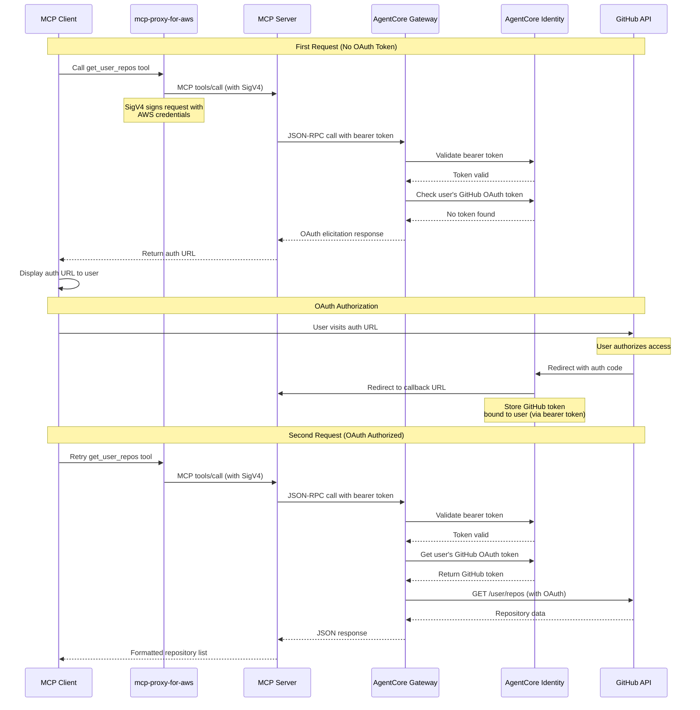
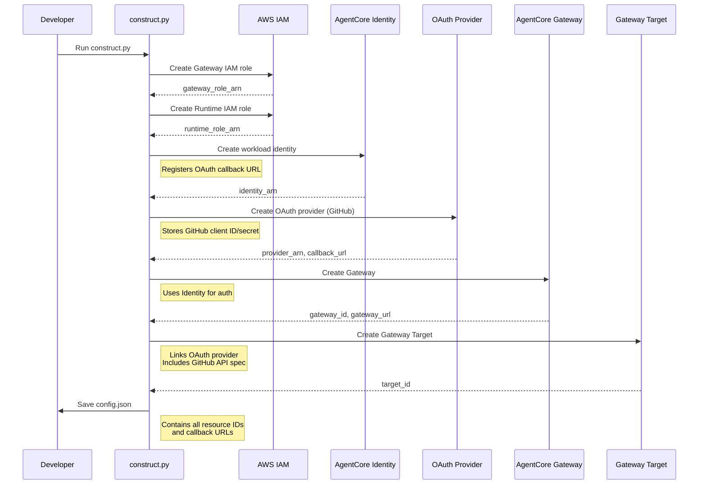

# MCP Server with OAuth Gateway

## Overview

This example demonstrates how to build an MCP server that interacts with 3rd party APIs through AgentCore Gateway using OAuth authentication. The server runs on AgentCore Runtime and is accessed by clients via `mcp-proxy-for-aws` using SigV4 authentication.

**Architecture Flow:**
```
Client (Claude Desktop)
  ↓ MCP Protocol
mcp-proxy-for-aws
  ↓ SigV4 Authentication
MCP Server (AgentCore Runtime)
  ↓ Bearer Token (from SigV4)
AgentCore Gateway
  ↓ OAuth (via AgentCore Identity)
3rd Party API (GitHub)
```

**Use Case**: Enabling MCP tools to securely access external APIs on behalf of authenticated users without exposing credentials, while running the MCP server on AWS infrastructure.

**Prerequisites:**
- AWS account with AgentCore access
- GitHub OAuth App credentials
  - Create at: https://github.com/settings/developers
  - Note down Client ID and Client Secret
- Python 3.10+
- AWS credentials configured
- `uv` for dependency management

## Quick Start

### 1. Setup Environment

```bash
cd mcp-server-with-oauth-gateway
cp .env.example .env
```

Edit `.env` and configure:
- `AWS_REGION`: Your AWS region (default: us-east-1)
- `GITHUB_CLIENT_ID`: From GitHub OAuth App
- `GITHUB_CLIENT_SECRET`: From GitHub OAuth App
- `OAUTH_CALLBACK_URL`: OAuth callback URL (default: http://localhost:8080/oauth/callback)

### 2. Build Infrastructure

```bash
uv run python construct.py
```

This creates:
- IAM roles for Gateway and Runtime
- Workload Identity for OAuth token storage
- OAuth credential provider for GitHub
- Gateway with MCP protocol support
- Gateway Target with GitHub API specification

**Important:** The script outputs an `oauth_callback_url`. You must register this URL in your GitHub OAuth App:
1. Go to https://github.com/settings/developers
2. Select your OAuth App
3. Add the `oauth_callback_url` to "Authorization callback URL"
4. Save changes

Configuration is saved to `config.json`.

### 3. Start OAuth Callback Server

In a separate terminal:

```bash
uv run python main.py --mode oauth-callback
```

This starts a web server on port 8080 to handle OAuth callbacks.

### 4. Run MCP Server

```bash
uv run python main.py --mode mcp
```

The server exposes two MCP tools:
- `get_user_repos`: Get authenticated user's GitHub repositories
- `get_user_profile`: Get authenticated user's GitHub profile

### 5. Connect via mcp-proxy-for-aws

Configure your MCP client (e.g., Claude Desktop) to connect via mcp-proxy-for-aws:

```json
{
  "mcpServers": {
    "github-mcp": {
      "command": "mcp-proxy-for-aws",
      "args": [
        "--region", "us-east-1",
        "--runtime-arn", "arn:aws:bedrock-agentcore:...:runtime/...",
        "--"
      ]
    }
  }
}
```

Replace the `runtime-arn` with the value from `config.json`.

## Demonstration Flow



## Construction Flow



## Specifications

### 1. MCP Server (`mcp_server_with_oauth_gateway/server.py`)

**Purpose**: MCP server that exposes tools for GitHub API access via AgentCore Gateway.

**Key Functions:**
- `call_gateway_tool(tool_name, arguments, context)`: Makes JSON-RPC calls to Gateway
  - Extracts bearer token from MCP context
  - Handles OAuth elicitation responses
  - Returns formatted results
- `get_user_repos()`: MCP tool to list user's repositories
- `get_user_profile()`: MCP tool to get user's profile

**Implementation Details:**
- Uses MCP protocol version `2025-11-25` for OAuth elicitation support
- Detects OAuth elicitation (error code -32042) and returns authorization URL
- Parses Gateway responses and formats for MCP clients

### 2. OAuth Callback Handler (`mcp_server_with_oauth_gateway/oauth_callback_handler.py`)

**Purpose**: Web server that handles OAuth callbacks from AgentCore Identity.

**Key Functions:**
- `_handle_oauth_callback(session_id)`: Processes OAuth callback
  - Acknowledges successful authorization
  - Instructs user to retry tool call

**Endpoints:**
- `GET /`: Home page
- `GET /oauth/callback?session_id=X`: OAuth callback endpoint

**Note**: In this architecture, the user binding happens automatically via the bearer token (derived from SigV4 credentials). The callback server primarily provides user feedback.

### 3. Infrastructure Construction (`construct.py`)

**Purpose**: Creates all required AWS resources for the example.

**Steps:**
1. **Create IAM Roles**
   - Gateway role: Allows bedrock-agentcore.amazonaws.com to invoke targets
   - Runtime role: Allows bedrock-agentcore.amazonaws.com to run MCP server

2. **Create Workload Identity**
   - Registers OAuth callback URL
   - Manages OAuth token storage with user binding

3. **Create OAuth Credential Provider**
   - Vendor: `GitHubOauth2`
   - Stores GitHub client ID and secret
   - Returns callback URL for GitHub OAuth App configuration

4. **Create Gateway**
   - Protocol: MCP (version 2025-11-25)
   - Authorizer: Workload Identity
   - Enables OAuth elicitation

5. **Create Gateway Target**
   - OpenAPI spec for GitHub API (`/user`, `/user/repos`)
   - OAuth configuration with scopes: `["repo", "user"]`
   - Links OAuth credential provider

**Output**: `config.json` with all resource identifiers and URLs

**Cleanup:**
```bash
uv run python construct.py --cleanup
```

### 4. Main Entry Point (`main.py`)

**Purpose**: Starts MCP server or OAuth callback server based on mode.

**Modes:**
- `--mode mcp`: Run MCP server (default)
- `--mode oauth-callback`: Run OAuth callback handler

**Configuration:**
- Loads `config.json`
- Sets environment variables for server
- Displays available tools and OAuth flow information

## Security Considerations

### Authentication Flow
- **Client → Proxy**: AWS credentials (SigV4)
- **Proxy → Server**: SigV4 signed MCP protocol
- **Server → Gateway**: Bearer token (derived from SigV4)
- **Gateway → GitHub**: OAuth access token (stored in Identity)

### Token Management
- **Bearer Token**: Derived from AWS credentials, validated by Workload Identity
- **GitHub Token**: Stored in AgentCore Identity, bound to bearer token
- **No Credential Exposure**: Client never sees GitHub credentials

### Production Recommendations
- **HTTPS Required**: Use HTTPS for callback URLs in production
- **Token Rotation**: Implement GitHub OAuth token refresh
- **IAM Policies**: Use least privilege instead of AdministratorAccess
- **Monitoring**: Log OAuth flows and Gateway requests
- **Rate Limiting**: Implement request throttling for GitHub API

## Architecture Details

### Why This Architecture?

1. **MCP Server on AgentCore Runtime**
   - Scalable: AWS manages server infrastructure
   - Secure: Runs in AWS environment with IAM controls
   - Integrated: Direct access to AgentCore Gateway

2. **AgentCore Gateway with OAuth**
   - Token Management: Identity stores and refreshes OAuth tokens
   - User Binding: Tokens bound to user via bearer token (SigV4)
   - Elicitation: Returns OAuth URLs when authorization needed

3. **Client via mcp-proxy-for-aws**
   - Authentication: Uses AWS credentials (SigV4)
   - Protocol: Standard MCP over AWS infrastructure
   - Secure: No credential sharing with MCP server

### User Identity Flow

1. Client authenticates with AWS credentials
2. `mcp-proxy-for-aws` signs requests with SigV4
3. MCP server receives bearer token (from SigV4)
4. Gateway validates bearer token with Workload Identity
5. Identity binds GitHub OAuth token to bearer token
6. Subsequent requests use same bearer token → same GitHub token

This ensures each AWS user has their own GitHub OAuth token.

## Troubleshooting

### Construction Issues

**"ResourceAlreadyExists" error**
```bash
uv run python construct.py --cleanup
```

**"AccessDenied" creating resources**
- Verify AWS credentials have permissions:
  - `iam:CreateRole`, `iam:AttachRolePolicy`
  - `bedrock-agentcore:*`

### OAuth Flow Issues

**"Redirect URI mismatch" from GitHub**
- Register the `oauth_callback_url` from `config.json` in GitHub OAuth App
- This is the AgentCore Identity callback URL, different from local callback server

**OAuth callback never completes**
- Verify callback server is running: `uv run python main.py --mode oauth-callback`
- Check port 8080 is accessible

### Runtime Issues

**"No bearer token provided"**
- Ensure `mcp-proxy-for-aws` is configured correctly
- Verify AWS credentials are available to proxy

**Tools return "error" instead of data**
- Check Gateway status: `aws bedrock-agentcore get-gateway --gateway-identifier <id>`
- Verify GitHub OAuth App is configured with correct callback URL
- Check server logs for detailed error messages

### Debug Commands

**List Gateways:**
```bash
aws bedrock-agentcore-control list-gateways --region us-east-1
```

**Get Gateway Status:**
```bash
aws bedrock-agentcore-control get-gateway --gateway-identifier <gateway-id> --region us-east-1
```

**List Workload Identities:**
```bash
aws bedrock-agentcore-control list-workload-identities --region us-east-1
```

## References

### AgentCore Documentation
- [AgentCore Gateway](https://docs.aws.amazon.com/bedrock/latest/userguide/agentcore-gateway.html)
- [AgentCore Identity](https://docs.aws.amazon.com/bedrock/latest/userguide/agentcore-identity.html)
- [AgentCore Runtime](https://docs.aws.amazon.com/bedrock/latest/userguide/agentcore-runtime.html)

### External Resources
- [GitHub OAuth Apps](https://docs.github.com/en/developers/apps/building-oauth-apps)
- [GitHub REST API](https://docs.github.com/en/rest)
- [Model Context Protocol](https://modelcontextprotocol.io/)
- [mcp-proxy-for-aws](https://github.com/aws-samples/mcp-proxy-for-aws)

### Related Examples
- [say-hello-to-authorized-customer](../say-hello-to-authorized-customer/): Direct Gateway OAuth with Cognito
