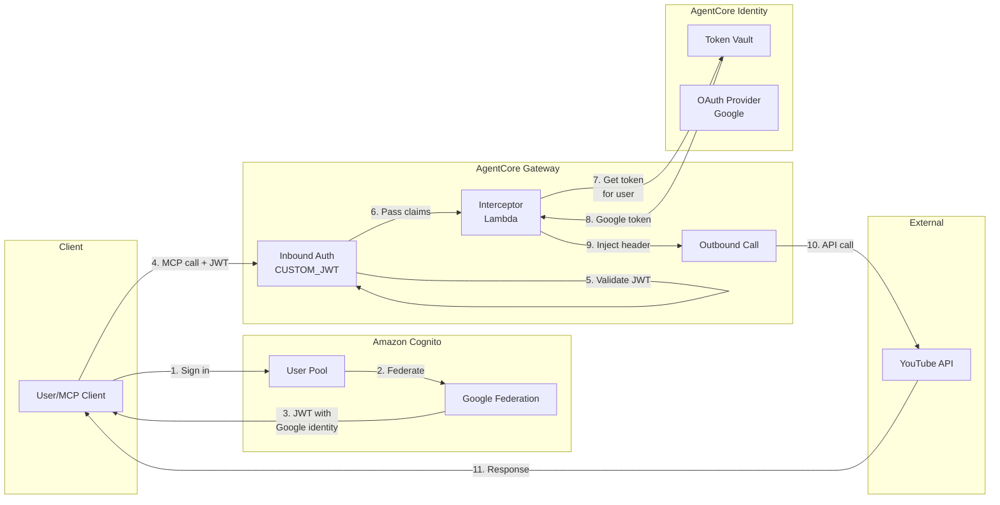
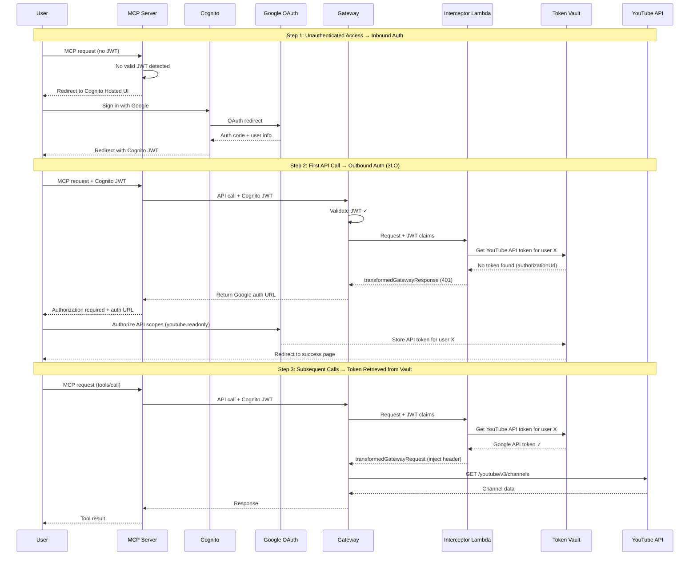
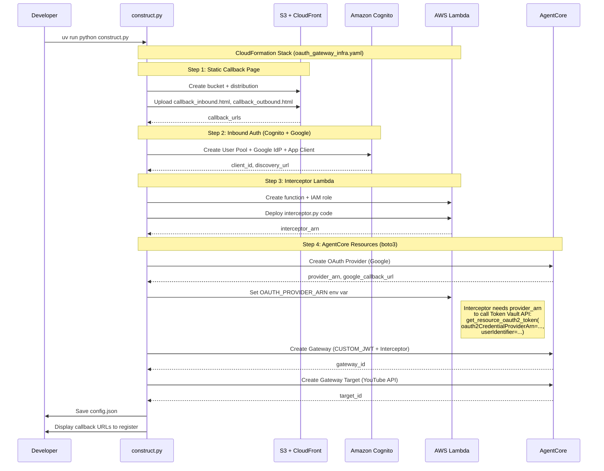

# MCP Server with OAuth Gateway

## Overview

This example demonstrates an **MCP server implementation that connects to AgentCore Gateway** with both **inbound OAuth authentication** (user identity) and **outbound OAuth authorization** (API access).

The MCP server exposes YouTube API tools to clients, while AgentCore Gateway handles:
- **Inbound Auth**: Validates user identity via Cognito JWT (federated with Google)
- **Outbound Auth**: Retrieves user-specific Google API tokens from Token Vault

**Key Concept: Single Google Identity, Dual Purpose**
- **Inbound**: User signs in with Google via Cognito → identifies WHO the user is
- **Outbound**: Same user's Google token from Token Vault → authorizes WHAT they can access

**Use Case**: Building MCP servers that securely access third-party APIs on behalf of authenticated users, with seamless single sign-on using Google for both authentication and authorization.

## Architecture



## Prerequisites

- AWS account with AgentCore access
- Google OAuth App credentials (https://console.cloud.google.com/apis/credentials)
- Python 3.10+
- AWS credentials configured
- `uv` for dependency management

## Quick Start

```bash
cd mcp-server-with-oauth-gateway
cp .env.example .env
# Edit .env with GOOGLE_CLIENT_ID and GOOGLE_CLIENT_SECRET
uv run python construct.py
# Register callback URLs in Google OAuth App
uv run python main.py
```

## Demonstration Flow



## Construction Flow



## Specifications

### Component Responsibilities

| Component | Responsibility |
|-----------|---------------|
| **Cognito** | Federate with Google, issue JWT with user identity |
| **Gateway (Inbound)** | Validate Cognito JWT, extract user claims |
| **Interceptor Lambda** | Map user identity → Google API token |
| **Token Vault** | Store Google API tokens per user |
| **Gateway (Outbound)** | Call YouTube API with injected token |

### Interceptor Lambda

**Input (from Gateway with `passRequestHeaders: true`):**
```json
{
  "interceptorInputVersion": "1.0",
  "mcp": {
    "rawGatewayRequest": {
      "body": "<raw_request_body>"
    },
    "gatewayRequest": {
      "path": "/mcp",
      "httpMethod": "POST",
      "headers": {
        "Authorization": "Bearer <cognito_jwt_token>",
        "Content-Type": "application/json"
      },
      "body": {
        "jsonrpc": "2.0",
        "id": 1,
        "method": "tools/call",
        "params": {"name": "...", "arguments": {}}
      }
    }
  }
}
```

**Logic:**
1. Extract JWT from `mcp.gatewayRequest.headers.Authorization`
2. Decode JWT to get claims (including `identities` for federated Google user)
3. Extract Google user ID from decoded `identities` claim
4. Call `GetResourceOauth2Token` with user ID
5. If token exists → inject into `Authorization` header via `transformedGatewayRequest`
6. If no token → return OAuth elicitation response via `transformedGatewayResponse`

**Output (token exists - inject for outbound call):**
```json
{
  "interceptorOutputVersion": "1.0",
  "mcp": {
    "transformedGatewayRequest": {
      "headers": {
        "Authorization": "Bearer <google_api_token>"
      },
      "body": {
        "jsonrpc": "2.0",
        "id": 1,
        "method": "tools/call",
        "params": {"name": "...", "arguments": {}}
      }
    }
  }
}
```

**Output (no token - trigger OAuth elicitation):**
```json
{
  "interceptorOutputVersion": "1.0",
  "mcp": {
    "transformedGatewayResponse": {
      "statusCode": 401,
      "headers": {
        "Content-Type": "application/json"
      },
      "body": {
        "error": "authorization_required",
        "authorizationUrl": "<google_oauth_authorization_url>",
        "message": "User must authorize YouTube API access"
      }
    }
  }
}
```

### Gateway Configuration

```python
# Inbound: Cognito JWT validation
authorizerType="CUSTOM_JWT"
authorizerConfiguration={
    "customJWTAuthorizer": {
        "discoveryUrl": cognito_discovery_url,
        "allowedClients": [cognito_client_id]
    }
}

# Interceptor: Bridge identity to token
interceptorConfigurations=[{
    "interceptor": {"lambda": {"arn": interceptor_arn}},
    "interceptionPoints": ["REQUEST"],
    "inputConfiguration": {"passRequestHeaders": True}
}]
```

## Security Considerations

- **Token Isolation**: Each user's Google token stored separately in Token Vault
- **Identity Binding**: Token retrieval requires matching user ID from JWT
- **Least Privilege**: Interceptor only has `GetResourceOauth2Token` permission
- **No Token Exposure**: Google tokens never sent to client

## Troubleshooting

| Issue | Solution |
|-------|----------|
| "JWT validation failed" | Check Cognito discovery URL and client ID match Gateway config |
| "No Google token found" | User needs to complete 3LO authorization via authorizationUrl |
| "Interceptor timeout" | Increase Lambda timeout, check VPC/network access to AgentCore |
| "Invalid redirect_uri" | Ensure callback URLs are registered in both Google OAuth App and Cognito |
| "Access denied on GetResourceOauth2Token" | Verify Lambda IAM role has `bedrock-agentcore:GetResourceOauth2Token` permission |

## References

### AgentCore Documentation
- [AgentCore Gateway Overview](https://docs.aws.amazon.com/bedrock/latest/userguide/agentcore-gateway.html)
- [Gateway Interceptors](https://docs.aws.amazon.com/bedrock/latest/userguide/agentcore-gateway-interceptors.html)
- [AgentCore Identity - Token Vault](https://docs.aws.amazon.com/bedrock/latest/userguide/agentcore-identity.html)
- [OAuth 2.0 Credential Providers](https://docs.aws.amazon.com/bedrock/latest/userguide/agentcore-identity-oauth.html)

### Amazon Cognito
- [User Pool Federation with Social IdPs](https://docs.aws.amazon.com/cognito/latest/developerguide/cognito-user-pools-identity-federation.html)
- [Adding Social Identity Providers](https://docs.aws.amazon.com/cognito/latest/developerguide/cognito-user-pools-social-idp.html)
- [Hosted UI Reference](https://docs.aws.amazon.com/cognito/latest/developerguide/cognito-user-pools-app-integration.html)

### Google OAuth
- [Creating OAuth 2.0 Client IDs](https://developers.google.com/identity/protocols/oauth2/web-server#creatingcred)
- [OAuth 2.0 Scopes for Google APIs](https://developers.google.com/identity/protocols/oauth2/scopes)
- [YouTube Data API](https://developers.google.com/youtube/v3)

### MCP (Model Context Protocol)
- [MCP Specification](https://spec.modelcontextprotocol.io/)
- [MCP Authentication](https://spec.modelcontextprotocol.io/specification/architecture/#authentication)
