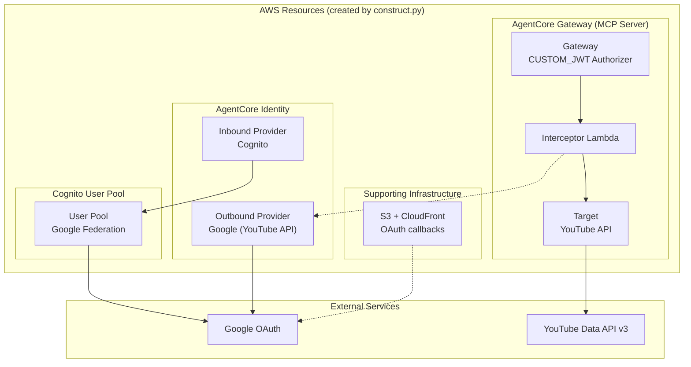
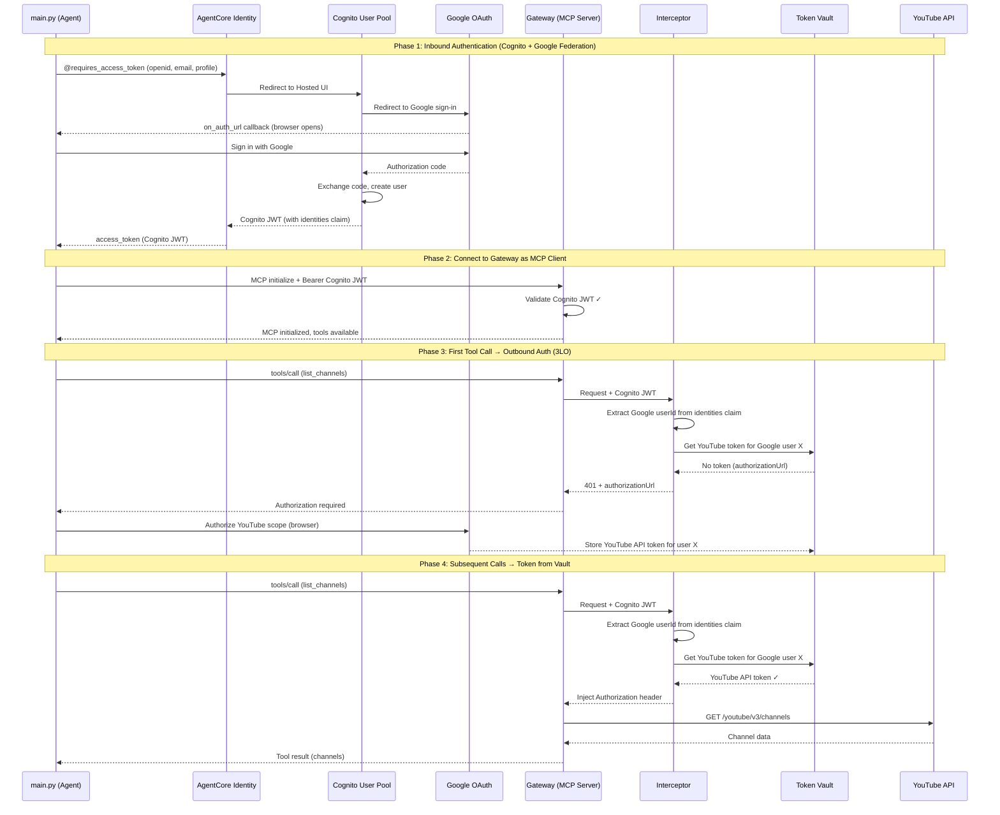
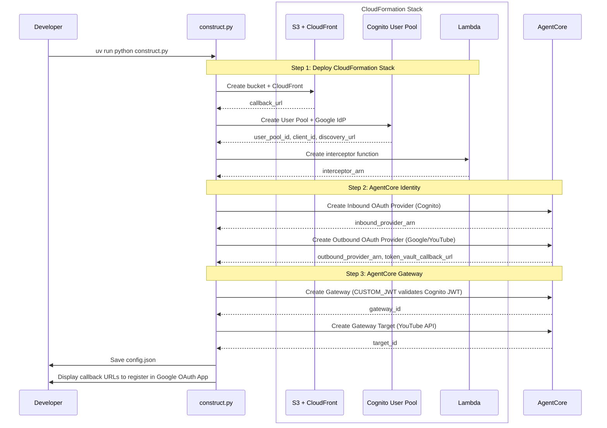

# Secure MCP with OAuth Gateway

## Overview

This example demonstrates a **secure MCP server built with AgentCore Gateway** featuring both **inbound OAuth authentication** (user identity) and **outbound OAuth authorization** (API access).

AgentCore Gateway serves as the MCP server, handling:
- **Inbound Auth**: **Authenticate** user via Google OAuth (federated through Cognito) → identifies WHO the user is
- **Outbound Auth**: **Authorize** user's API access via Token Vault → authorizes WHAT they can access

**Use Case**: Building secure MCP servers that access third-party APIs on behalf of authenticated users with authorized tools.

## Architecture



### Why We need Cognito ?

AgentCore Identity providers have different capabilities:

| Provider | Inbound (User Identity) | Outbound (API Access) |
|----------|------------------------|----------------------|
| **Google** | ❌ Not supported | ✅ Supported |
| **Cognito** | ✅ Supported | ✅ Supported |

Google OAuth provider in AgentCore is designed **only for outbound resource access**, not for inbound user authentication ([AWS Doc](https://docs.aws.amazon.com/bedrock-agentcore/latest/devguide/identity-idp-google.html)).

**Solution**: Cognito with Google Federation enables Google sign-in for inbound auth while preserving Google user ID for outbound token lookup.


## Prerequisites

- AWS account with AgentCore access
- Google OAuth App credentials (https://console.cloud.google.com/apis/credentials)
  - Enable YouTube Data API v3
- Python 3.10+
- AWS credentials configured
- `uv` for dependency management

## Quick Start

```bash
cd oauth-gateway-from-agent
cp .env.example .env
# Edit .env with GOOGLE_CLIENT_ID and GOOGLE_CLIENT_SECRET
uv run python construct.py
# Register callback URLs in Google OAuth App (shown after construct.py)
uv run python main.py
```

## Demonstration Flow



## Construction Flow



## Specifications

### Component Responsibilities

| Component | Responsibility |
|-----------|---------------|
| **Cognito User Pool** | Federate Google sign-in, issue JWT with `identities` claim |
| **AgentCore Identity (Inbound)** | Issue Cognito JWT (Google federated) via `@requires_access_token` |
| **Gateway (Inbound Auth)** | Validate Cognito JWT, pass claims to Interceptor |
| **Interceptor Lambda** | Extract Google user ID from JWT `identities` claim → retrieve YouTube token from Token Vault |
| **Token Vault** | Store YouTube API tokens per user (keyed by Google user ID) |
| **Gateway (Outbound)** | Call YouTube API with injected token |

### Cognito User Pool (Google Federation)

Cognito acts as the identity broker between Google and the Gateway:

| Configuration | Value |
|--------------|-------|
| Identity Provider | Google (federated) |
| OAuth Flows | Authorization Code |
| Scopes | `openid`, `email`, `profile` |
| Callback URL | CloudFront distribution URL (`callback_inbound.html`) |

**JWT Claims (after Google sign-in):**
```json
{
  "sub": "aaaaaaaa-bbbb-cccc-dddd-eeeeeeeeeeee",
  "email": "user@example.com",
  "cognito:username": "Google_123456789",
  "identities": [
    {
      "userId": "123456789",
      "providerName": "Google",
      "providerType": "Google",
      "issuer": null,
      "primary": "true",
      "dateCreated": "1642699117273"
    }
  ],
  "iss": "https://cognito-idp.<region>.amazonaws.com/<user-pool-id>",
  "aud": "<client-id>",
  "token_use": "id"
}
```

The `identities` claim contains the Google user ID (`userId`), which the Interceptor uses to retrieve the user's YouTube API token from Token Vault.

### OAuth Providers

| Provider | Purpose | Scopes |
|----------|---------|--------|
| Inbound | User identity (Cognito + Google federation) | `openid`, `email`, `profile` |
| Outbound | YouTube API | `youtube.readonly` |

### main.py (Strands Agent)

**Note on `@requires_access_token` for Inbound Auth:**
While `@requires_access_token` is typically used for outbound OAuth (getting API tokens), we leverage it here for **inbound authentication** to streamline the OAuth flow. The decorator handles the browser-based OAuth dance and returns a Cognito JWT (with Google federation) that:
1. Authenticates the user via Google sign-in (WHO they are)
2. Is validated by the Gateway's CUSTOM_JWT authorizer
3. Contains `identities` claim with Google user ID, used by the Interceptor to retrieve the user's YouTube API token from Token Vault

```python
from bedrock_agentcore.identity import requires_access_token
from mcp.client.streamable_http import streamablehttp_client
from strands import Agent
from strands.tools.mcp import MCPClient

@requires_access_token(
    provider_name=INBOUND_PROVIDER_NAME,  # Cognito with Google federation
    scopes=["openid", "email", "profile"],
    auth_flow="USER_FEDERATION",
    on_auth_url=lambda url: webbrowser.open(url),  # Opens browser for Google sign-in
)
def run_agent(*, access_token: str):
    """Run agent with Gateway as MCP server.
    
    The access_token is a Cognito JWT (Google federated) containing:
    - sub: Cognito user ID
    - identities: [{"providerName": "Google", "userId": "<google_user_id>"}]
    
    Gateway validates this JWT. Interceptor extracts Google user ID
    from identities claim to retrieve their YouTube API token from Token Vault.
    """
    mcp_client = MCPClient(
        lambda: streamablehttp_client(
            GATEWAY_ENDPOINT,
            headers={"Authorization": f"Bearer {access_token}"}
        )
    )
    with mcp_client:
        tools = mcp_client.list_tools_sync()
        agent = Agent(tools=tools)
        response = agent("List my YouTube channels")
        print(response)
```

### Interceptor Lambda

**Logic:**
1. Extract JWT from `Authorization` header
2. Decode JWT to get Google user ID from `identities` claim (falls back to `sub` if not federated)
3. Call `GetResourceOauth2Token` with user ID and outbound provider ARN
4. If token exists → inject into `Authorization` header via `transformedGatewayRequest`
5. If no token → return OAuth elicitation response via `transformedGatewayResponse`

**Output (token exists):**
```json
{
  "interceptorOutputVersion": "1.0",
  "mcp": {
    "transformedGatewayRequest": {
      "headers": {"Authorization": "Bearer <youtube_api_token>"},
      "body": {"jsonrpc": "2.0", "id": 1, "method": "tools/call", ...}
    }
  }
}
```

**Output (no token - trigger 3LO):**
```json
{
  "interceptorOutputVersion": "1.0",
  "mcp": {
    "transformedGatewayResponse": {
      "statusCode": 401,
      "body": {
        "error": "authorization_required",
        "authorizationUrl": "<google_oauth_url>",
        "message": "User must authorize YouTube API access"
      }
    }
  }
}
```

### Gateway Configuration

```python
# Inbound: Google OIDC JWT validation
authorizerType="CUSTOM_JWT"
authorizerConfiguration={
    "customJWTAuthorizer": {
        "discoveryUrl": "https://accounts.google.com/.well-known/openid-configuration",
        "allowedAudiences": [google_client_id]
    }
}

# Interceptor: Bridge identity to API token
interceptorConfigurations=[{
    "interceptor": {"lambda": {"arn": interceptor_arn}},
    "interceptionPoints": ["REQUEST"],
}]

# Outbound: Handled by Interceptor Lambda
# - Interceptor calls GetResourceOauth2Token with outbound_provider_arn
# - Token Vault returns Google API token for the authenticated user
# - Interceptor injects token into Authorization header
```

## Security Considerations

- **Token Isolation**: Each user's Google token stored separately in Token Vault
- **Identity Binding**: Token retrieval requires matching user ID from JWT
- **Scope Separation**: Inbound (identity) and outbound (API) use different scopes
- **Least Privilege**: Interceptor only has `GetResourceOauth2Token` permission
- **No Token Exposure**: Google API tokens never sent to client

## Troubleshooting

| Issue | Solution |
|-------|----------|
| "JWT validation failed" | Verify Google client ID matches Gateway's allowedAudiences |
| "No Google token found" | User needs to complete 3LO authorization via authorizationUrl |
| "Interceptor timeout" | Increase Lambda timeout, check network access to AgentCore |
| "Invalid redirect_uri" | Ensure callback URLs are registered in Google OAuth App |
| "Access denied on GetResourceOauth2Token" | Verify Lambda IAM role has `bedrock-agentcore:GetResourceOauth2Token` permission |

## References

### AgentCore Documentation
- [AgentCore Gateway Overview](https://docs.aws.amazon.com/bedrock/latest/userguide/agentcore-gateway.html)
- [Gateway Interceptors](https://docs.aws.amazon.com/bedrock/latest/userguide/agentcore-gateway-interceptors.html)
- [AgentCore Identity - Token Vault](https://docs.aws.amazon.com/bedrock/latest/userguide/agentcore-identity.html)
- [OAuth 2.0 Credential Providers](https://docs.aws.amazon.com/bedrock/latest/userguide/agentcore-identity-oauth.html)

### Google OAuth
- [Creating OAuth 2.0 Client IDs](https://developers.google.com/identity/protocols/oauth2/web-server#creatingcred)
- [OAuth 2.0 Scopes for Google APIs](https://developers.google.com/identity/protocols/oauth2/scopes)
- [YouTube Data API](https://developers.google.com/youtube/v3)

### MCP (Model Context Protocol)
- [MCP Specification](https://spec.modelcontextprotocol.io/)
- [MCP Authentication](https://spec.modelcontextprotocol.io/specification/architecture/#authentication)
