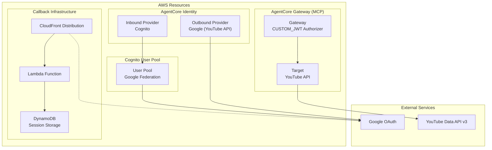
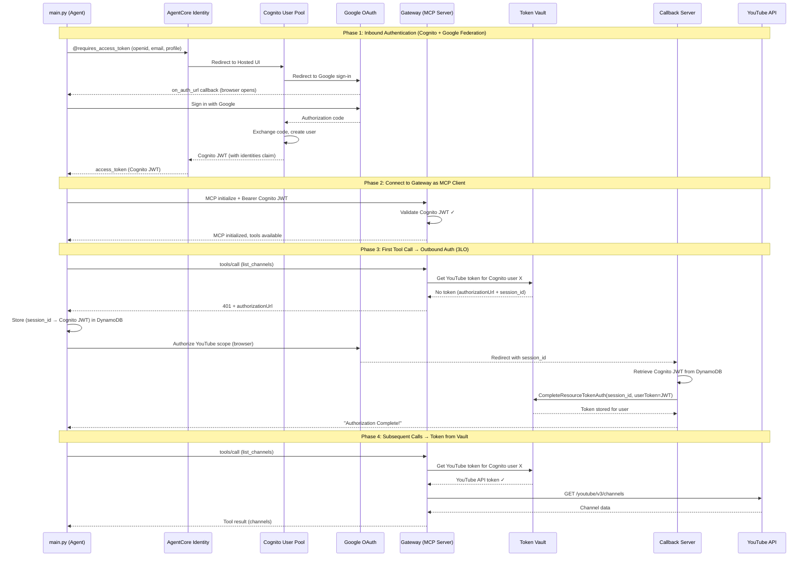
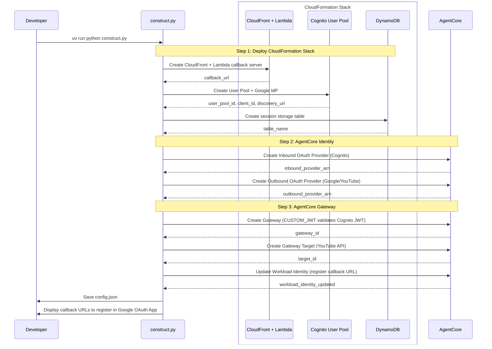

# Secure MCP with OAuth Gateway

## Overview

This example demonstrates a **secure MCP server built with AgentCore Gateway** featuring both **inbound OAuth authentication** (user identity) and **outbound OAuth authorization** (API access).

AgentCore Gateway serves as the MCP server, handling:
- **Inbound Auth**: **Authenticate** user via Google OAuth (federated through Cognito) → identifies WHO the user is
- **Outbound Auth**: **Authorize** user's API access via Token Vault → authorizes WHAT they can access

**Use Case**: Building secure MCP servers that access third-party APIs on behalf of authenticated users with authorized tools.

## Architecture



### Why We need Cognito ?

AgentCore Identity providers have different capabilities:

| Provider | Inbound (User Identity) | Outbound (API Access) |
|----------|------------------------|----------------------|
| **Google** | ❌ Not supported | ✅ Supported |
| **Cognito** | ✅ Supported | ✅ Supported |

Google OAuth provider in AgentCore is designed **only for outbound resource access**, not for inbound user authentication ([AWS Doc](https://docs.aws.amazon.com/bedrock-agentcore/latest/devguide/identity-idp-google.html)).

**Solution**: Cognito with Google Federation enables Google sign-in for inbound auth while preserving Google user ID for outbound token lookup.


## Prerequisites

- AWS account with AgentCore access
- Google OAuth App credentials (https://console.cloud.google.com/apis/credentials)
  - Enable YouTube Data API v3
- Python 3.10+
- AWS credentials configured
- `uv` for dependency management

## Quick Start

```bash
cd oauth-gateway-from-agent
cp .env.example .env
# Edit .env with GOOGLE_CLIENT_ID and GOOGLE_CLIENT_SECRET
uv run python construct.py
# Register callback URLs in Google OAuth App (shown after construct.py)
uv run python main.py
```

## Demonstration Flow



## Construction Flow



## Specifications

### Component Responsibilities

| Component | Responsibility |
|-----------|---------------|
| **Cognito User Pool** | Federate Google sign-in, issue JWT with `identities` claim |
| **AgentCore Identity (Inbound)** | Issue Cognito JWT (Google federated) via `@requires_access_token` |
| **main.py (Agent)** | Extract Cognito user ID from JWT, store session for OAuth binding |
| **Token Vault** | Store YouTube API tokens per user (keyed by Cognito user ID) |
| **Gateway** | Validate Cognito JWT, call YouTube API with retrieved token |

### Cognito User Pool (Google Federation)

Cognito acts as the identity broker between Google and the Gateway:

| Configuration | Value |
|--------------|-------|
| Identity Provider | Google (federated) |
| OAuth Flows | Authorization Code |
| Scopes | `openid`, `email`, `profile` |
| Callback URL | CloudFront distribution URL (`callback_inbound.html`) |

**JWT Claims (after Google sign-in):**
```json
{
  "sub": "aaaaaaaa-bbbb-cccc-dddd-eeeeeeeeeeee",
  "email": "user@example.com",
  "cognito:username": "Google_123456789",
  "identities": [
    {
      "userId": "123456789",
      "providerName": "Google",
      "providerType": "Google",
      "issuer": null,
      "primary": "true",
      "dateCreated": "1642699117273"
    }
  ],
  "iss": "https://cognito-idp.<region>.amazonaws.com/<user-pool-id>",
  "aud": "<client-id>",
  "token_use": "id"
}
```

The `identities` claim contains the Google user ID (`userId`), but the system uses the Cognito user ID (`sub` claim) for token storage and retrieval in Token Vault.

**Why Cognito `sub` instead of Google `userId`?**

The `sub` (subject) claim is the **standard JWT claim** that uniquely identifies the user within the issuing system (Cognito). AgentCore's Token Vault uses the JWT `sub` claim as the user identifier, not custom claims like `identities`.

When `CompleteResourceTokenAuth` is called:
1. AgentCore extracts `sub` claim from the JWT (e.g., `"aaaaaaaa-bbbb-cccc-dddd-eeeeeeeeeeee"`)
2. Stores token as: `(Workload Identity + sub claim) → YouTube token`
3. Retrieves tokens using the same `sub` claim from subsequent requests

Using Google user ID from `identities` claim would create a mismatch - AgentCore would still use the `sub` claim internally, causing token storage/retrieval failures.

### OAuth Callback Server (CloudFront + Lambda)

The callback server handles OAuth session binding for outbound authentication. When users authorize YouTube API access, Google redirects to this server to complete the token storage process.

**Why Not a Static Site?**
OAuth session binding requires **stateful management** to prevent session hijacking. A static site cannot:
- Store session data to map `session_id` to user identity  
- Verify that the OAuth callback matches the original authorization request
- Call AgentCore APIs to complete secure token binding

**Security Problem:** Without state tracking, any user could intercept another user's `session_id` from the callback URL and hijack their OAuth session.

**Solution:** The callback server stores `(session_id → user_jwt)` in DynamoDB, ensuring only the user who initiated the OAuth flow can complete it.

**Architecture:**
- **CloudFront Distribution**: Public endpoint with DDoS protection and WAF capability
- **Lambda Function**: Processes OAuth callbacks and completes session binding
- **DynamoDB Table**: Stores session data with TTL for automatic cleanup
- **Origin Access Control (OAC)**: Restricts Lambda access to CloudFront only

**Key Implementation Details:**
- Lambda requires latest boto3 via Layer (built-in boto3 lacks `bedrock-agentcore` service)
- Workload identity must register callback URL in `allowedResourceOauth2ReturnUrls`
- Session binding uses `userToken` (full JWT) not `userId` for authentication
- Lambda needs `secretsmanager:GetSecretValue` permission (required by `CompleteResourceTokenAuth`)

**Session Binding Flow:**
1. User completes OAuth at Google → redirected to CloudFront URL with `session_id`
2. Lambda retrieves stored `user_token` from DynamoDB using `session_id`
3. Lambda calls `CompleteResourceTokenAuth(session_id, userToken=jwt)`
4. AgentCore stores YouTube token in Token Vault scoped to (Gateway + User)

### OAuth Providers

| Provider | Purpose | Scopes |
|----------|---------|--------|
| Inbound | User identity (Cognito + Google federation) | `openid`, `email`, `profile` |
| Outbound | YouTube API | `youtube.readonly` |

### main.py (Strands Agent)

**Note on `@requires_access_token` for Inbound Auth:**
While `@requires_access_token` is typically used for outbound OAuth (getting API tokens), we leverage it here for **inbound authentication** to streamline the OAuth flow. The decorator handles the browser-based OAuth dance and returns a Cognito JWT (with Google federation) that:
1. Authenticates the user via Google sign-in (WHO they are)
2. Is validated by the Gateway's CUSTOM_JWT authorizer
3. Contains `identities` claim with Google user ID, but the system uses Cognito user ID (`sub` claim) for token operations

**Security: Token Storage TTL**
The 5-minute TTL for encrypted token storage only affects the **initial OAuth authorization flow**, not ongoing YouTube API access:
- **During OAuth setup**: User token stored temporarily (5 min) for session binding
- **After OAuth completion**: Token deleted, Gateway manages YouTube tokens directly
- **Ongoing usage**: Users can access YouTube API for hours/days without re-authorization
- **Google controls expiration**: Gateway auto-refreshes YouTube tokens (typically 1-hour access tokens)
- **Re-authorization needed only when**: Google revokes access or refresh tokens expire (months of inactivity)

```python
from bedrock_agentcore.identity import requires_access_token
from mcp.client.streamable_http import streamablehttp_client
from strands import Agent
from strands.tools.mcp import MCPClient

@requires_access_token(
    provider_name=INBOUND_PROVIDER_NAME,  # Cognito with Google federation
    scopes=["openid", "email", "profile"],
    auth_flow="USER_FEDERATION",
    on_auth_url=lambda url: webbrowser.open(url),  # Opens browser for Google sign-in
)
def run_agent(*, access_token: str):
    """Run agent with Gateway as MCP server.
    
    The access_token is a Cognito JWT (Google federated) containing:
    - sub: Cognito user ID
    - identities: [{"providerName": "Google", "userId": "<google_user_id>"}]
    
    Gateway validates this JWT. The agent extracts Cognito user ID (`sub` claim)
    for token storage and session binding operations.
    """
    mcp_client = MCPClient(
        lambda: streamablehttp_client(
            GATEWAY_ENDPOINT,
            headers={"Authorization": f"Bearer {access_token}"}
        )
    )
    with mcp_client:
        tools = mcp_client.list_tools_sync()
        agent = Agent(tools=tools)
        response = agent("List my YouTube channels")
        print(response)
```

### AgentCore Gateway

AgentCore Gateway serves as the **MCP server** that bridges your agent to external APIs with built-in authentication and authorization.

#### Gateway's Role

```
┌─────────────────────────────────────────────────────────────────────┐
│                      AgentCore Gateway                              │
├─────────────────────────────────────────────────────────────────────┤
│                                                                     │
│  1. INBOUND AUTH: "Who is this user?"                               │
│     - Validates JWT from Cognito (CUSTOM_JWT authorizer)            │
│     - Extracts user identity (sub claim, identities claim)          │
│                                                                     │
│  2. WORKLOAD IDENTITY: "Who is this application?"                   │
│     - Gateway has its own identity in AgentCore                     │
│     - Scopes user tokens: (Gateway + User) → unique token entry     │
│     - Defines trusted callback URLs for OAuth flows                 │
│                                                                     │
│  3. OUTBOUND AUTH: "What can this user access?"                     │
│     - Retrieves user's API tokens from Token Vault                  │
│     - Triggers OAuth flow if token not found (elicitation)          │
│     - Injects tokens into requests to external APIs                 │
│                                                                     │
└─────────────────────────────────────────────────────────────────────┘
```

#### Workload Identity

When you create a Gateway, AgentCore automatically creates a **Workload Identity** for it. Think of it as the Gateway's "corporate identity" in AgentCore's world:

```
Workload Identity = "mcp-oauth-gateway-gateway-xyz"
        │
        ├── Represents THIS Gateway application
        │
        ├── Token Vault entries are scoped to (Workload Identity + User)
        │   └── Same user through different Gateways = separate tokens
        │
        └── allowedResourceOauth2ReturnUrls
            └── Trusted callback URLs for OAuth session binding
```

**Why Workload Identity matters for OAuth:**

Think of it like a company handling employee requests:

```
Workload Identity = "Acme Corp Gateway" (the company)
User (JWT)        = Employee with ID badge
Token Vault       = Secure filing cabinet
session_id        = Request form number

Scenario: Employee B needs YouTube API access

1. Employee B (JWT) enters Acme Corp building
2. Security validates: "Is this badge from Acme Corp?" ✓
3. Employee B: "I need YouTube access"
4. Acme Corp checks filing cabinet: "Acme Corp → Employee B → YouTube... not found"
5. Acme Corp: "Fill out authorization form #session_id, go to Google to approve"
6. Employee B completes OAuth at Google
7. Google sends Employee B back to Acme Corp's registered address
   (allowedResourceOauth2ReturnUrls = company's trusted mailroom)
8. Acme Corp mailroom verifies: "Is this really Employee B completing THEIR form?"
   → Calls CompleteResourceTokenAuth(session_id, Employee B's badge)
9. AgentCore stores: "Acme Corp → Employee B → YouTube → [token]"

Why the registered address matters:
- If a stranger intercepts the form and tries to complete it at a fake address,
  AgentCore rejects it: "That's not Acme Corp's registered mailroom!"
- Only callbacks from allowedResourceOauth2ReturnUrls are trusted
```

```python
# Register callback URL with Workload Identity
client.update_workload_identity(
    name=gateway_id,  # Workload Identity name = Gateway ID
    allowedResourceOauth2ReturnUrls=["https://your-callback.cloudfront.net/"]
)
```

#### Gateway Configuration

```python
# Inbound: Cognito JWT validation
authorizerType="CUSTOM_JWT"
authorizerConfiguration={
    "customJWTAuthorizer": {
        "discoveryUrl": cognito_discovery_url,
        "allowedClients": [cognito_client_id]
    }
}

# Outbound: OAuth with session binding for 3LO
credentialProviderConfigurations=[{
    "credentialProviderType": "OAUTH",
    "credentialProvider": {
        "oauthCredentialProvider": {
            "providerArn": outbound_provider_arn,
            "grantType": "AUTHORIZATION_CODE",
            "defaultReturnUrl": callback_url,  # Where to redirect after OAuth
            "scopes": ["https://www.googleapis.com/auth/youtube.readonly"]
        }
    }
}]
```

#### OAuth Session Binding Flow

```
1. User requests YouTube data → Gateway checks Token Vault → No token found
2. Gateway returns elicitation with auth URL containing session_id
3. User completes OAuth at Google
4. Google redirects to AgentCore → AgentCore redirects to YOUR callback (defaultReturnUrl)
5. Your callback calls CompleteResourceTokenAuth(session_id, userToken)
   - session_id: identifies this authorization attempt
   - userToken: the inbound JWT proving user identity
6. AgentCore stores token in Vault: (Workload Identity + User) → YouTube token
7. Subsequent requests use stored token automatically
```

## Security Considerations

- **Token Isolation**: Each user's Google token stored separately in Token Vault
- **Identity Binding**: Token retrieval requires matching user ID from JWT
- **Scope Separation**: Inbound (identity) and outbound (API) use different scopes
- **No Token Exposure**: Google API tokens never sent to client

## Troubleshooting

| Issue | Solution |
|-------|----------|
| "JWT validation failed" | Verify Google client ID matches Gateway's allowedAudiences |
| "No Google token found" | User needs to complete 3LO authorization via authorizationUrl |
| "Invalid redirect_uri" | Ensure callback URLs are registered in Google OAuth App |

## References

### AgentCore Documentation
- [AgentCore Gateway Overview](https://docs.aws.amazon.com/bedrock/latest/userguide/agentcore-gateway.html)
- [AgentCore Identity - Token Vault](https://docs.aws.amazon.com/bedrock/latest/userguide/agentcore-identity.html)
- [OAuth 2.0 Credential Providers](https://docs.aws.amazon.com/bedrock/latest/userguide/agentcore-identity-oauth.html)

### Google OAuth
- [Creating OAuth 2.0 Client IDs](https://developers.google.com/identity/protocols/oauth2/web-server#creatingcred)
- [OAuth 2.0 Scopes for Google APIs](https://developers.google.com/identity/protocols/oauth2/scopes)
- [YouTube Data API](https://developers.google.com/youtube/v3)

### MCP (Model Context Protocol)
- [MCP Specification](https://spec.modelcontextprotocol.io/)
- [MCP Authentication](https://spec.modelcontextprotocol.io/specification/architecture/#authentication)
