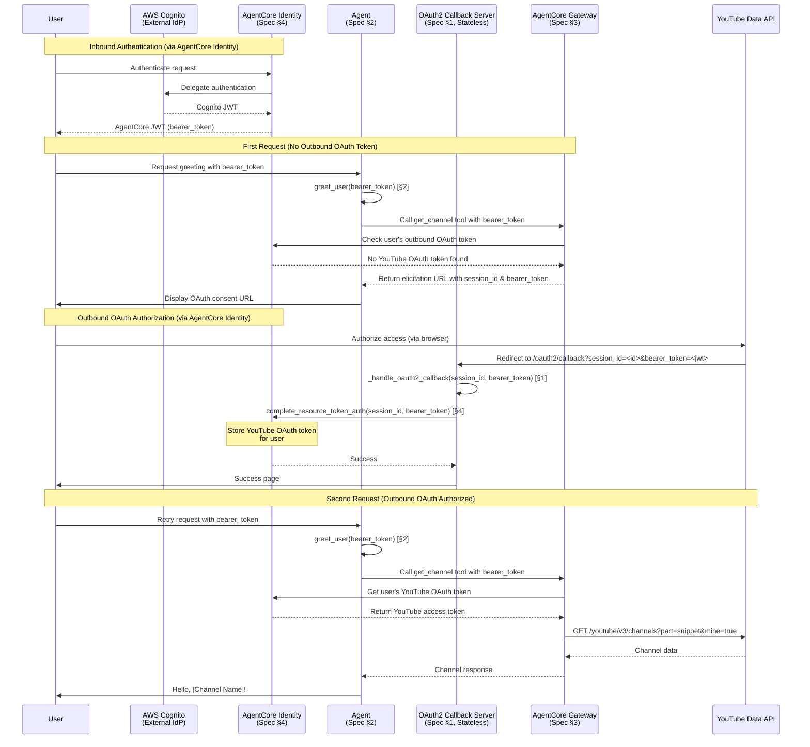

# Say Hello to Authorized Customer

## Overview

This example demonstrates how to build an agent that greets users with their YouTube channel name using AgentCore Identity and AgentCore Gateway with OAuth 2.0 Authorization Code Grant (3-legged OAuth). The agent securely accesses Google's YouTube Data API on behalf of authenticated users to retrieve their channel information.

**Use Case**: User-delegated access to external APIs where the agent acts on behalf of an authenticated user without ever seeing their credentials.

**Prerequisites**:
- AWS account with AgentCore access
- Google Cloud Console project with OAuth 2.0 credentials and YouTube Data API v3 enabled
- Python 3.10+
- AWS credentials configured
- `uv` for dependency management

## Quick Start

1. Navigate to the example directory:
   ```bash
   cd say-hello-to-authorized-customer
   ```

2. Copy environment variables:
   ```bash
   cp .env.example .env
   ```

3. Configure your credentials in `.env`:
   - Set AWS region
   - Add YouTube OAuth client ID and secret (from Google Cloud Console)
   - Configure redirect URI
   - Enable YouTube Data API v3 in Google Cloud Console

4. Run the example:
   ```bash
   uv run python main.py
   ```

## Architecture



**Component Specifications**:
- **Cognito (AWS Cognito)**: External identity provider integrated with AgentCore Identity for user authentication
- **Identity (AgentCore Identity)**: See Section 4 - Single point of authentication flow manager:
  - **Inbound Authentication**: Manages Cognito integration, delegates authentication to Cognito, and issues AgentCore JWT (bearer_token)
  - **Outbound OAuth**: Manages OAuth sessions with external resources (e.g., YouTube) and binds them to authenticated users
  - **Token Management**: Securely stores and manages OAuth tokens for users
- **OAuth2Server (Stateless)**: See Section 1 - Stateless callback handler that receives OAuth callbacks and delegates token storage to AgentCore Identity
- **Gateway**: See Section 3 - Proxies YouTube API calls with OAuth authentication
- **Agent**: See Section 2 - Orchestrates greeting flow and passes bearer_token for user identification
- **OAuth Flow**: See Section 1 "Complete OAuth Flow Process" for detailed 7-step sequence

## Specifications

### 1. OAuth2 Callback Server (`oauth2_callback_server.py`)

**Purpose**: Stateless HTTP server that handles OAuth 2.0 authorization code callbacks and delegates token storage to AgentCore Identity.

**Complete OAuth Flow Process**:
1. **Inbound Authentication**: User authenticates via AgentCore Identity, which delegates to Cognito and returns AgentCore JWT (bearer_token)
2. **Elicitation**: Agent passes bearer_token to Gateway, which detects outbound authorization required and returns YouTube authorization URL with session_id and bearer_token
3. **User Consent**: User visits authorization URL and grants permission to access their YouTube channel
4. **Callback**: YouTube redirects to `/oauth2/callback?session_id=<id>&bearer_token=<jwt>`
5. **Token Exchange**: Callback handler receives bearer_token from query params and calls `identity_client.complete_resource_token_auth(session_id, bearer_token)` 
6. **Token Storage**: AgentCore Identity exchanges authorization code for YouTube OAuth token and stores it securely, bound to user
7. **Resource Access**: Agent can now call YouTube Data API - Gateway retrieves user's YouTube OAuth token from AgentCore Identity

**Key Functions**:
- `get_oauth2_callback_base_url() -> str`: Returns callback URL for OAuth provider redirects
- `OAuth2CallbackServer.__init__(region: str)`: Initializes stateless FastAPI server with Identity client
- `OAuth2CallbackServer._handle_oauth2_callback(session_id: str, bearer_token: str)`: Receives OAuth callback and delegates to AgentCore Identity (stateless - no token storage)

**Endpoints**:
- `GET /ping`: Health check
- `GET /oauth2/callback?session_id=<id>&bearer_token=<jwt>`: OAuth callback handler (stateless - passes bearer_token to Identity)

**Configuration**:
- Port: 9090 (configurable via constant)
- Supports both localhost and SageMaker Workshop Studio environments

**Stateless Design**: 
- No in-memory token storage
- No session state management
- Bearer token passed via query parameter from elicitation URL
- All token storage and user binding handled by AgentCore Identity token vault
- Supports concurrent multi-user OAuth flows without race conditions

### 2. Agent Implementation (`say_hello_to_authorized_customer/agent.py`)

**Purpose**: Core agent logic that orchestrates the greeting flow with user authentication context.

**Key Functions**:
- `create_agent(gateway_arn: str, region: str) -> Agent`: Creates agent with Gateway tools
- `greet_user(agent: Agent, bearer_token: str) -> str`: Executes greeting flow, passing bearer_token for user identification

**Behavior**:
- Passes bearer_token to Gateway for user identification
- Detects elicitation responses from Gateway (contains session_id and bearer_token in callback URL)
- Displays OAuth consent URL to user
- Retries tool call after user authorization
- Formats greeting message with YouTube channel name

### 3. Gateway (`gateway_for_tools.py`)

**Purpose**: Manages AgentCore Gateway creation and configuration.

**Key Functions**:
- `create_gateway(name: str, youtube_client_id: str, youtube_client_secret: str, callback_url: str, region: str) -> str`: Creates Gateway with YouTube OAuth target
- `delete_gateway(gateway_arn: str, region: str)`: Cleanup function

**Gateway Configuration**:
- Target: YouTube Data API v3 (`https://www.googleapis.com/youtube/v3`)
- OAuth Scopes: `https://www.googleapis.com/auth/youtube.readonly`
- Outbound Auth: Authorization Code Grant
- MCP Version: `2025-11-25`

### 4. Identity (`identity_for_authorization.py`)

**Purpose**: Manages AgentCore Identity as a single point of authentication flow manager for secure token storage and user binding.

**Key Functions**:
- `create_workload_identity(name: str, callback_url: str, region: str) -> str`: Creates workload identity with OAuth return URL
- `complete_resource_token_auth(session_id: str, bearer_token: str)`: Exchanges authorization code for YouTube OAuth token and stores it securely, bound to user identified by bearer_token
- `delete_workload_identity(identity_arn: str, region: str)`: Cleanup function

**Identity Configuration**:
- Allowed OAuth return URLs: Callback server URL (with bearer_token query parameter)
- User identifier source: JWT `sub` claim from bearer_token
- **Token Management**: AgentCore Identity manages OAuth token storage and user binding
- **Dual Role**: Manages both inbound authentication (user → agent via Cognito) and outbound OAuth (agent → YouTube)

### 5. Main Entry Point (`main.py`)

**Purpose**: Orchestrates the complete flow from setup to execution.

**Flow**:
1. Load configuration from `.env`
2. Start stateless OAuth2 callback server
3. Create workload identity with callback URL (including bearer_token parameter)
4. Create gateway with OAuth configuration
5. Create agent with gateway tools
6. Get bearer_token from inbound authentication
7. Execute greeting flow with bearer_token
8. Cleanup resources

**Error Handling**:
- Validates environment variables
- Handles OAuth flow interruptions
- Provides clear error messages
- Ensures resource cleanup

### 6. Configuration Template (`.env.example`)

**Required Variables**:
```
AWS_REGION=us-east-1
YOUTUBE_CLIENT_ID=your-client-id.apps.googleusercontent.com
YOUTUBE_CLIENT_SECRET=your-client-secret
CALLBACK_URL=http://localhost:9090/oauth2/callback
```

**Note**: Obtain YouTube OAuth credentials from [Google Cloud Console](https://console.cloud.google.com/) and enable YouTube Data API v3.

## Security Considerations for Production

### Stateless Callback Server Design
- **No token storage**: Callback server is stateless and doesn't store JWTs or OAuth tokens
- **Bearer token in URL**: Bearer token passed via query parameter in callback URL (HTTPS required in production)
- **Multi-user support**: Stateless design eliminates race conditions in concurrent OAuth flows
- **No session management**: All state managed by AgentCore Identity

### AgentCore Identity Token Management
- **Secure storage**: OAuth tokens managed by AgentCore Identity service
- **User binding**: Tokens bound to users via JWT `sub` claim from bearer_token
- **Automatic management**: Token lifecycle handled by AgentCore Identity
- **Session tracking**: OAuth sessions tracked via session_id from elicitation URL
- **Multi-user support**: Concurrent OAuth flows supported natively

### Credential Management
- **Never hardcode credentials**: Use AWS Secrets Manager or environment variables
- **Rotate OAuth secrets**: Implement regular rotation of YouTube OAuth client secrets
- **HTTPS for callbacks**: Use HTTPS for callback URLs in production (required for bearer_token in URL)
- **JWT validation**: AgentCore Identity validates JWT signatures before token binding

### Input Validation
- **Validate OAuth state parameter**: Prevent CSRF attacks in OAuth flow
- **Sanitize user inputs**: Validate all user-provided data
- **Verify JWT signatures**: Validate identity tokens before extracting claims

### Rate Limiting
- **Implement request throttling**: Prevent abuse of YouTube API quotas
- **Handle rate limit errors**: Gracefully handle 429 responses from YouTube
- **Monitor API usage**: Track and alert on unusual patterns

### Error Handling
- **Avoid exposing sensitive information**: Don't leak tokens or secrets in error messages
- **Log security events**: Record OAuth flows and authorization attempts
- **Implement timeout handling**: Set appropriate timeouts for OAuth flows

### Logging
- **Log OAuth events**: Track authorization grants and token usage
- **Redact sensitive data**: Never log access tokens or refresh tokens
- **Enable audit trails**: Maintain records for compliance

### IAM Permissions
- **Principle of least privilege**: Grant minimal permissions to AgentCore resources
- **Use resource-based policies**: Restrict access to specific gateways and identities
- **Implement MFA**: Require multi-factor authentication for administrative actions

### Network Security
- **Use VPC endpoints**: Keep AgentCore traffic within AWS network
- **Implement IP allowlisting**: Restrict callback server access if possible
- **Enable TLS**: Use HTTPS for all external communications

## Troubleshooting

### OAuth Flow Issues

**Problem**: "Redirect URI mismatch" error from YouTube/Google
- **Solution**: Ensure `CALLBACK_URL` in `.env` matches the authorized redirect URI in Google Cloud Console
- **Check**: Verify the callback server is accessible at the configured URL

**Problem**: OAuth callback never completes
- **Solution**: Check that the callback server is running and accessible
- **Debug**: Check server logs for incoming requests
- **Verify**: Ensure firewall rules allow traffic on port 9090

### Gateway Configuration Issues

**Problem**: "Gateway not found" error
- **Solution**: Verify the gateway ARN is correct and the gateway exists
- **Check**: Use AWS CLI to list gateways: `aws bedrock-agentcore list-gateways`

**Problem**: "Invalid OAuth configuration" error
- **Solution**: Verify YouTube OAuth client ID and secret are correct
- **Check**: Ensure OAuth scopes are properly configured and YouTube Data API v3 is enabled

### Identity Issues

**Problem**: "User token identifier not found"
- **Solution**: Ensure bearer_token is passed correctly in the callback URL
- **Check**: Verify the JWT token contains the expected `sub` claim
- **Debug**: Check AgentCore Identity logs for token validation errors

### Agent Execution Issues

**Problem**: Agent doesn't detect elicitation response
- **Solution**: Verify the Gateway is configured with MCP version `2025-11-25`
- **Check**: Ensure the agent is checking for elicitation in tool responses

**Problem**: "Channel not found" error
- **Solution**: Verify the user granted the required OAuth scopes
- **Check**: Ensure the YouTube Data API v3 is enabled in Google Cloud Console
- **Verify**: User has a YouTube channel associated with their Google account

### Common Error Messages

- `CredentialsError`: AWS credentials not configured or invalid
- `ConfigurationError`: Missing or invalid environment variables
- `OAuthError`: OAuth flow failed or was cancelled by user
- `GatewayError`: Gateway configuration or invocation failed
- `IdentityError`: Identity service error or invalid token

### Debug Logging

Enable debug logging by setting environment variable:
```bash
export LOG_LEVEL=DEBUG
uv run python main.py
```

### Useful AWS CLI Commands

List gateways:
```bash
aws bedrock-agentcore list-gateways --region us-east-1
```

Describe gateway:
```bash
aws bedrock-agentcore get-gateway --gateway-identifier <gateway-arn> --region us-east-1
```

List workload identities:
```bash
aws bedrock-agentcore list-workload-identities --region us-east-1
```

## References

### AgentCore Documentation
- [AgentCore Identity API Reference](https://aws.github.io/bedrock-agentcore-starter-toolkit/api-reference/identity.md) - Complete Identity client API documentation
- [AgentCore Gateway Integration Guide](https://aws.github.io/bedrock-agentcore-starter-toolkit/examples/gateway-integration.md) - Gateway setup and OAuth token management patterns
- [AgentCore Gateway Documentation](https://docs.aws.amazon.com/bedrock/latest/userguide/agentcore-gateway.html) - Official AWS Gateway documentation
- [AgentCore Identity Documentation](https://docs.aws.amazon.com/bedrock/latest/userguide/agentcore-identity.html) - Official AWS Identity documentation

### External Resources
- [OAuth 2.0 Authorization Code Grant](https://oauth.net/2/grant-types/authorization-code/) - OAuth 2.0 specification
- [YouTube Data API v3](https://developers.google.com/youtube/v3) - YouTube API documentation
- [YouTube OAuth Scopes](https://developers.google.com/youtube/v3/guides/auth/server-side-web-apps) - YouTube OAuth guide
- [MCP URL Mode Elicitation](https://blog.modelcontextprotocol.io/posts/2025-11-25-first-mcp-anniversary/#url-mode-elicitation-secure-out-of-band-interactions) - MCP elicitation pattern
