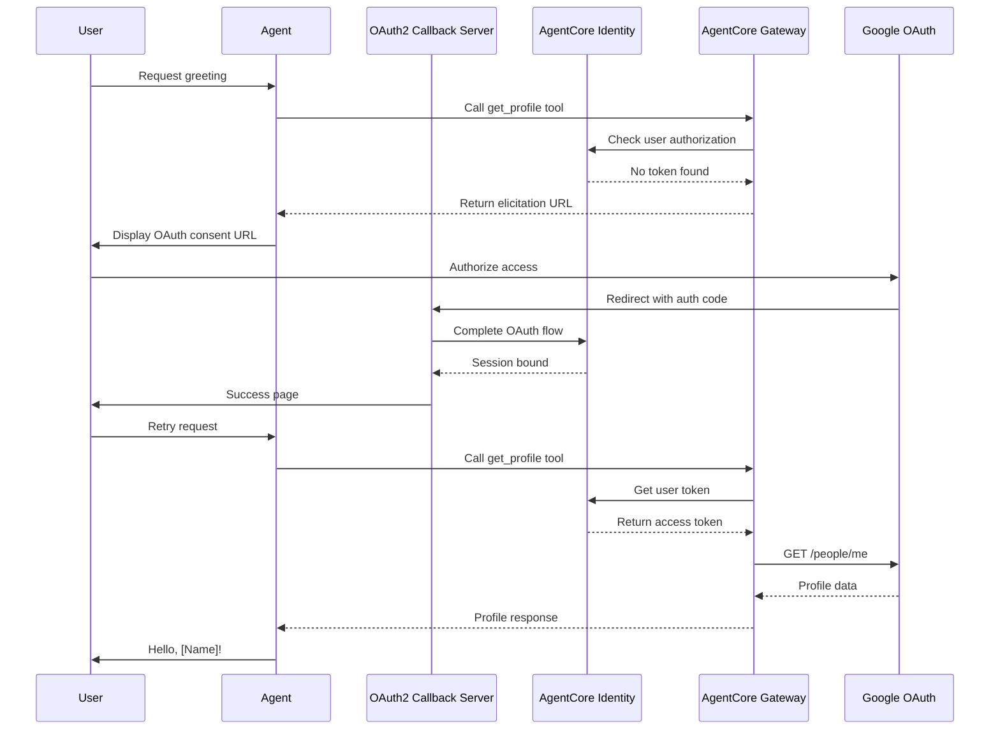

# Say Hello to Authorized Customer

## Overview

This example demonstrates how to build an agent that greets users with their Google account profile name using AgentCore Identity and AgentCore Gateway with OAuth 2.0 Authorization Code Grant (3-legged OAuth). The agent securely accesses Google's People API on behalf of authenticated users to retrieve their profile information.

**Use Case**: User-delegated access to external APIs where the agent acts on behalf of an authenticated user without ever seeing their credentials.

**Prerequisites**:
- AWS account with AgentCore access
- Google Cloud Console project with OAuth 2.0 credentials
- Python 3.10+
- AWS credentials configured
- `uv` for dependency management

## Quick Start

1. Navigate to the example directory:
   ```bash
   cd say-hello-to-authorized-customer
   ```

2. Copy environment variables:
   ```bash
   cp .env.example .env
   ```

3. Configure your credentials in `.env`:
   - Set AWS region
   - Add Google OAuth client ID and secret
   - Configure redirect URI

4. Run the example:
   ```bash
   uv run python main.py
   ```

## Architecture



## Specifications

### 1. OAuth2 Callback Server (`oauth2_callback_server.py`)

**Purpose**: Local HTTP server that handles OAuth 2.0 callback redirects from Google.

**Key Functions**:
- `get_oauth2_callback_base_url() -> str`: Returns the callback URL for OAuth provider redirects
- `store_token_in_oauth2_callback_server(identity_client, user_token_identifier)`: Stores user token identifier before OAuth flow
- `OAuth2CallbackServer.__init__(region: str)`: Initializes FastAPI server with Identity client
- `OAuth2CallbackServer.start()`: Starts the callback server on port 9090

**Endpoints**:
- `POST /userIdentifier/token`: Store user token identifier
- `GET /ping`: Health check
- `GET /oauth2/callback?session_id=<id>`: OAuth callback handler

**Configuration**:
- Port: 9090 (configurable via constant)
- Supports both localhost and SageMaker Workshop Studio environments

### 2. Agent Implementation (`say_hello_to_authorized_customer/agent.py`)

**Purpose**: Core agent logic that orchestrates the greeting flow.

**Key Functions**:
- `create_agent(gateway_arn: str, region: str) -> Agent`: Creates agent with Gateway tools
- `greet_user(agent: Agent, user_token: str) -> str`: Executes greeting flow with user context

**Behavior**:
- Detects elicitation responses from Gateway
- Displays OAuth consent URL to user
- Retries tool call after user authorization
- Formats greeting message with profile name

### 3. Gateway Configuration (`gateway_config.py`)

**Purpose**: Manages AgentCore Gateway creation and configuration.

**Key Functions**:
- `create_gateway(name: str, google_client_id: str, google_client_secret: str, callback_url: str, region: str) -> str`: Creates Gateway with Google OAuth target
- `delete_gateway(gateway_arn: str, region: str)`: Cleanup function

**Gateway Configuration**:
- Target: Google People API (`https://people.googleapis.com`)
- OAuth Scopes: `profile`, `openid`
- Outbound Auth: Authorization Code Grant
- MCP Version: `2025-11-25`

### 4. Identity Configuration (`identity_config.py`)

**Purpose**: Manages AgentCore Identity workload identity and user token binding.

**Key Functions**:
- `create_workload_identity(name: str, callback_url: str, region: str) -> str`: Creates workload identity with OAuth return URL
- `get_user_token_identifier(id_token: str) -> UserTokenIdentifier`: Extracts user identifier from JWT
- `delete_workload_identity(identity_arn: str, region: str)`: Cleanup function

**Identity Configuration**:
- Allowed OAuth return URLs: Callback server URL
- User identifier source: JWT `sub` claim

### 5. Main Entry Point (`main.py`)

**Purpose**: Orchestrates the complete flow from setup to execution.

**Flow**:
1. Load configuration from `.env`
2. Start OAuth2 callback server
3. Create workload identity
4. Create gateway with OAuth configuration
5. Create agent with gateway tools
6. Execute greeting flow
7. Cleanup resources

**Error Handling**:
- Validates environment variables
- Handles OAuth flow interruptions
- Provides clear error messages
- Ensures resource cleanup

### 6. Configuration Template (`.env.example`)

**Required Variables**:
```
AWS_REGION=us-east-1
GOOGLE_CLIENT_ID=your-client-id.apps.googleusercontent.com
GOOGLE_CLIENT_SECRET=your-client-secret
CALLBACK_URL=http://localhost:9090/oauth2/callback
```

## Security Considerations for Production

### Credential Management
- **Never hardcode credentials**: Use AWS Secrets Manager or environment variables
- **Rotate OAuth secrets**: Implement regular rotation of Google OAuth client secrets
- **Secure token storage**: Use encrypted storage for user tokens in production
- **Callback server security**: Use HTTPS for callback URLs in production environments

### Input Validation
- **Validate OAuth state parameter**: Prevent CSRF attacks in OAuth flow
- **Sanitize user inputs**: Validate all user-provided data
- **Verify JWT signatures**: Validate identity tokens before extracting claims

### Rate Limiting
- **Implement request throttling**: Prevent abuse of Google API quotas
- **Handle rate limit errors**: Gracefully handle 429 responses from Google
- **Monitor API usage**: Track and alert on unusual patterns

### Error Handling
- **Avoid exposing sensitive information**: Don't leak tokens or secrets in error messages
- **Log security events**: Record OAuth flows and authorization attempts
- **Implement timeout handling**: Set appropriate timeouts for OAuth flows

### Logging
- **Log OAuth events**: Track authorization grants and token usage
- **Redact sensitive data**: Never log access tokens or refresh tokens
- **Enable audit trails**: Maintain records for compliance

### IAM Permissions
- **Principle of least privilege**: Grant minimal permissions to AgentCore resources
- **Use resource-based policies**: Restrict access to specific gateways and identities
- **Implement MFA**: Require multi-factor authentication for administrative actions

### Network Security
- **Use VPC endpoints**: Keep AgentCore traffic within AWS network
- **Implement IP allowlisting**: Restrict callback server access if possible
- **Enable TLS**: Use HTTPS for all external communications

## Troubleshooting

### OAuth Flow Issues

**Problem**: "Redirect URI mismatch" error from Google
- **Solution**: Ensure `CALLBACK_URL` in `.env` matches the authorized redirect URI in Google Cloud Console
- **Check**: Verify the callback server is accessible at the configured URL

**Problem**: OAuth callback never completes
- **Solution**: Check that the callback server is running and accessible
- **Debug**: Check server logs for incoming requests
- **Verify**: Ensure firewall rules allow traffic on port 9090

### Gateway Configuration Issues

**Problem**: "Gateway not found" error
- **Solution**: Verify the gateway ARN is correct and the gateway exists
- **Check**: Use AWS CLI to list gateways: `aws bedrock-agentcore list-gateways`

**Problem**: "Invalid OAuth configuration" error
- **Solution**: Verify Google OAuth client ID and secret are correct
- **Check**: Ensure OAuth scopes are properly configured

### Identity Issues

**Problem**: "User token identifier not found"
- **Solution**: Ensure the user has completed the OAuth flow
- **Check**: Verify the JWT token contains the expected `sub` claim

**Problem**: "Session binding failed"
- **Solution**: Ensure the callback server stored the user token identifier before OAuth flow
- **Debug**: Check callback server logs for token storage events

### Agent Execution Issues

**Problem**: Agent doesn't detect elicitation response
- **Solution**: Verify the Gateway is configured with MCP version `2025-11-25`
- **Check**: Ensure the agent is checking for elicitation in tool responses

**Problem**: "Profile not found" error
- **Solution**: Verify the user granted the required OAuth scopes
- **Check**: Ensure the Google People API is enabled in Google Cloud Console

### Common Error Messages

- `CredentialsError`: AWS credentials not configured or invalid
- `ConfigurationError`: Missing or invalid environment variables
- `OAuthError`: OAuth flow failed or was cancelled by user
- `GatewayError`: Gateway configuration or invocation failed
- `IdentityError`: Identity service error or invalid token

### Debug Logging

Enable debug logging by setting environment variable:
```bash
export LOG_LEVEL=DEBUG
uv run python main.py
```

### Useful AWS CLI Commands

List gateways:
```bash
aws bedrock-agentcore list-gateways --region us-east-1
```

Describe gateway:
```bash
aws bedrock-agentcore get-gateway --gateway-identifier <gateway-arn> --region us-east-1
```

List workload identities:
```bash
aws bedrock-agentcore list-workload-identities --region us-east-1
```

## References

- [AgentCore Gateway Documentation](https://docs.aws.amazon.com/bedrock/latest/userguide/agentcore-gateway.html)
- [AgentCore Identity Documentation](https://docs.aws.amazon.com/bedrock/latest/userguide/agentcore-identity.html)
- [OAuth 2.0 Authorization Code Grant](https://oauth.net/2/grant-types/authorization-code/)
- [Google People API](https://developers.google.com/people)
- [MCP URL Mode Elicitation](https://blog.modelcontextprotocol.io/posts/2025-11-25-first-mcp-anniversary/#url-mode-elicitation-secure-out-of-band-interactions)
