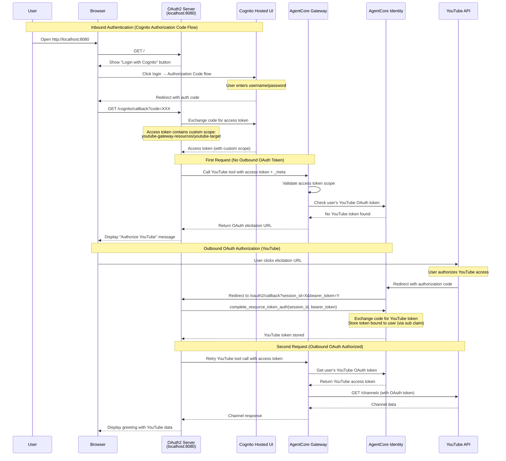
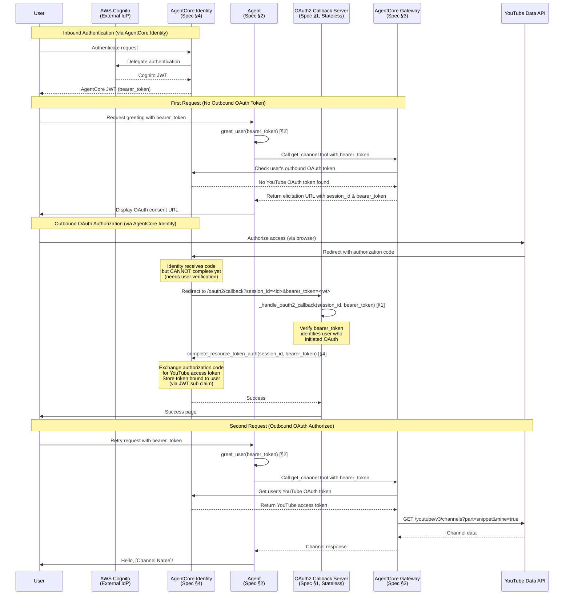
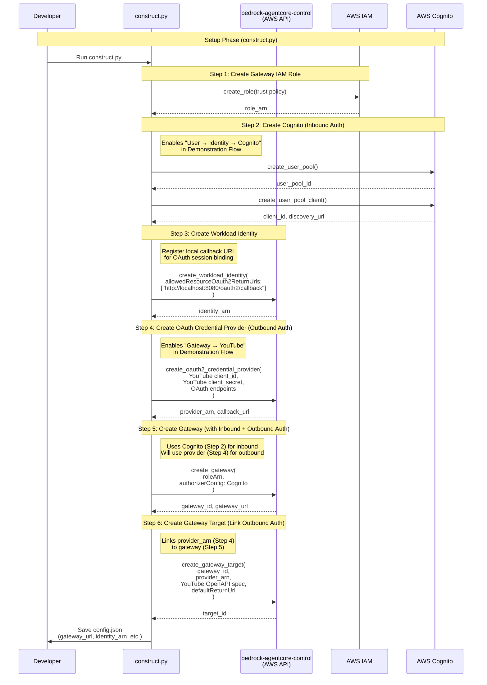

# Say Hello to Authorized Customer

## Overview

This example demonstrates how to build an agent that greets users with personalized messages based on their YouTube data using AgentCore Identity and AgentCore Gateway with OAuth 2.0 Authorization Code Grant (3-legged OAuth). The agent securely accesses Google's YouTube Data API on behalf of authenticated users to retrieve their channel name and subscriptions, then generates a friendly greeting like "Hello [Channel Name]! You subscribe to [Subscription] that has fantastic videos!"

**Use Case**: User-delegated access to external APIs where the agent acts on behalf of an authenticated user without ever seeing their credentials.

**Prerequisites**:
- AWS account with AgentCore access
- Google Cloud Console project with:
  - OAuth 2.0 credentials (Client ID and Secret)
  - YouTube Data API v3 enabled
  - Ability to add authorized redirect URIs
- Python 3.10+
- AWS credentials configured
- `uv` for dependency management

## Quick Start

1. Navigate to the example directory:
   ```bash
   cd say-hello-to-authorized-customer
   ```

2. Copy environment variables:
   ```bash
   cp .env.example .env
   ```

3. Configure your credentials in `.env`:
   - Set AWS region
   - Add YouTube OAuth client ID and secret (from Google Cloud Console)
   - Set `BASE_URL` (default: `http://localhost:8080`, change if using port forwarding)
   - Enable YouTube Data API v3 in Google Cloud Console

4. Build AgentCore components:
   ```bash
   uv run python construct.py
   ```
   - Script outputs `oauth_callback_url` (e.g., `https://bedrock-agentcore.amazonaws.com/identities/callback/...`)
   - **IMPORTANT**: Register this URL in Google Cloud Console:
     1. Go to APIs & Services → Credentials
     2. Select your OAuth 2.0 Client ID
     3. Add the `oauth_callback_url` to "Authorized redirect URIs"
     4. Save changes
   - `config.json` is generated for keeping IDs of all created resources (for cleanup)

5. Create a Cognito user (first time only):
   ```bash
   uv run python main.py --signup --username myuser --password MyPass123!
   ```

6. Run the demonstration:
   ```bash
   uv run python main.py
   ```
   - Server starts on http://localhost:8080
   - Open browser and click "Login with Cognito"
   - Enter your username and password in Cognito Hosted UI
   - Authorize YouTube access when prompted
   - See personalized greeting with your YouTube data

## Demonstration Flow

This diagram shows the **runtime behavior** when a user interacts with the agent (what you'll see when running `main.py`):



**Runtime Components**:
- **Cognito Hosted UI**: Web-based login for user authentication (Authorization Code flow)
- **OAuth2 Server (localhost:8080)**: Handles both Cognito and YouTube OAuth callbacks
  - `/`: Home page with "Login with Cognito" button
  - `/cognito/callback`: Exchanges Cognito auth code for access token with custom scope
  - `/oauth2/callback`: Completes YouTube OAuth and retries Gateway call
- **Identity (AgentCore Identity)**: 
  - **Inbound role**: Validates Cognito access tokens
  - **Outbound role**: Stores YouTube OAuth tokens per user (bound via `sub` claim)
- **Gateway**: Proxies YouTube API calls with OAuth authentication
  - **First request**: Validates custom scope, returns OAuth elicitation URL
  - **Second request**: Uses stored YouTube token to call API

**Key Insight**: Two separate OAuth flows:
1. **Cognito Authorization Code flow** (Inbound): Gets access token with custom scope `youtube-gateway-resources/youtube-target`
2. **YouTube OAuth flow** (Outbound): Gets YouTube access token for API calls

**Why custom scope?** Gateway requires this scope in the JWT when using OAuth credential providers for outbound authentication.



**Runtime Components**:
- **Cognito (AWS Cognito)**: External identity provider for user authentication
- **Identity (AgentCore Identity)**: Manages inbound authentication and outbound OAuth token storage
  - **Inbound role**: Issues AgentCore JWT (bearer_token) after Cognito authentication
  - **Outbound role**: Stores YouTube OAuth tokens per user, binds via JWT `sub` claim
- **OAuth2Server (Stateless)**: Handles OAuth callbacks and delegates token storage to Identity
  - **Why needed**: Identity cannot complete OAuth until application verifies which user initiated the flow (prevents security attacks)
  - **Stateless design**: Bearer_token passed via query parameter, no server-side state
- **Gateway**: Proxies YouTube API calls with OAuth authentication
  - **First request**: Detects missing OAuth token, returns elicitation URL
  - **Second request**: Uses stored OAuth token to call YouTube API
- **Agent**: Orchestrates greeting flow and passes bearer_token for user identification
  - **First request**: Displays OAuth consent URL to user
  - **Second request**: Retrieves channel name and formats greeting

## Construction Flow

This diagram shows **how AgentCore components are built** before the demonstration runs (what happens in `construct.py`):



**Construction Steps**:
1. **IAM Role**: Gateway needs permissions to invoke targets
2. **Cognito (Inbound Auth)**: Authenticates users accessing the agent
   - Enables: "User → Identity → Cognito" flow in Demonstration Flow
   - Provides: JWT tokens that identify users
3. **Workload Identity**: Registers local callback URL for OAuth session binding
   - Enables: AgentCore Identity to redirect to local callback server
   - Registers: `http://localhost:8080/oauth2/callback` as allowed return URL
4. **OAuth Credential Provider (Outbound Auth)**: Stores YouTube OAuth configuration
   - Enables: "Gateway → YouTube" connection in Demonstration Flow
   - Contains: YouTube client_id, client_secret, OAuth endpoints
   - Returns: `callback_url` to register with Google Cloud Console
5. **Gateway**: MCP endpoint that agents connect to
   - Uses: Cognito (Step 2) for inbound authentication
   - Will use: Provider (Step 4) for outbound authentication (linked in Step 6)
6. **Gateway Target**: Links the OAuth provider to the Gateway
   - Connects: Gateway (Step 5) with Provider (Step 4)
   - Configures: `defaultReturnUrl` pointing to local callback server
   - Enables: Gateway to authenticate with YouTube on behalf of users

**Authentication Flow Clarification**:

**Inbound Auth (Step 2 → Demonstration Flow)**:
- **Purpose**: Authenticate users who want to use the agent
- **Setup**: Cognito user pool and client (Step 2)
- **Runtime**: "User → Identity → Cognito" (top of Demonstration Flow)
- **Result**: User receives bearer_token (AgentCore JWT)

**Outbound Auth (Steps 3-5 → Demonstration Flow)**:
- **Purpose**: Authenticate Gateway with YouTube on behalf of users
- **Setup**: OAuth credential provider (Step 3) + Gateway target (Step 5)
- **Runtime**: "Gateway → YouTube" with user's OAuth token (bottom of Demonstration Flow)
- **Result**: Gateway can access YouTube API for specific user

**Key Insight**: 
- **Inbound** = Who can use the agent (Cognito authenticates users)
- **Outbound** = What the agent can access (OAuth authenticates Gateway to YouTube)
- Both are configured during construction, used during demonstration

## Specifications

### 1. Agent (`say_hello_to_authorized_customer/agent.py`)

**Purpose**: Core agent logic that makes raw JSON-RPC calls to Gateway with OAuth configuration.

#### Demonstration
**Runtime behavior** (see Demonstration Flow diagram):

**Key Functions**:
- `call_gateway_tool(gateway_url, bearer_token, tool_name, arguments, return_url, force_auth)`: Makes raw JSON-RPC call
  - Uses MCP protocol version `2025-11-25` (required for OAuth elicitation)
  - Includes `_meta` parameter with OAuth configuration
  - Returns JSON-RPC response
- `greet_user(gateway_url, bearer_token, return_url)`: Executes greeting flow
  - Calls YouTube API via Gateway
  - Detects OAuth elicitation (error code -32001)
  - Extracts authorization URL from error response
  - Returns greeting or "OAuth authorization pending"

**Implementation**:
```python
def call_gateway_tool(gateway_url, bearer_token, tool_name, arguments, return_url, force_auth=False):
    headers = {
        "Content-Type": "application/json",
        "Authorization": f"Bearer {bearer_token}",
        "MCP-Protocol-Version": "2025-11-25"  # Required for OAuth elicitation
    }
    
    _meta = {
        "aws.bedrock-agentcore.gateway/credentialProviderConfiguration": {
            "oauthCredentialProvider": {
                "returnUrl": return_url,
                "forceAuthentication": force_auth
            }
        }
    }
    
    payload = {
        "jsonrpc": "2.0",
        "id": 1,
        "method": "tools/call",
        "params": {
            "name": tool_name,
            "arguments": arguments,
            "_meta": _meta
        }
    }
    
    response = requests.post(gateway_url, headers=headers, json=payload)
    return response.json()
```

**Why raw JSON-RPC?** Strands MCP client uses protocol version `2025-03-26` which doesn't support OAuth URL elicitation. Version `2025-11-25` is required.

**OAuth Elicitation Detection**:
```python
if "error" in result and result["error"].get("code") == -32001:
    auth_url = result["error"]["data"]["authorizationUrl"]
    # Display URL to user
```

### 2. OAuth2 Callback Server (`oauth2_callback_server.py`)

**Purpose**: Web server handling both Cognito and YouTube OAuth flows.

**Design Note**: Stateful server that maintains access token between Cognito authentication and YouTube OAuth completion.

#### Demonstration
**Runtime behavior** (see Demonstration Flow diagram):

**Key Functions**:
- `OAuth2CallbackServer.__init__(region, config)`: Initializes FastAPI server
  - Stores region and config (gateway_url, user_pool_id, etc.)
  - Creates Identity client for completing YouTube OAuth
  - Maintains access token in memory
- `_handle_cognito_callback(code)`: Handles Cognito Authorization Code callback
  - Exchanges auth code for access token with custom scope
  - Stores access token in `self.access_token`
  - Calls Gateway to trigger YouTube OAuth elicitation
  - Displays authorization URL to user
- `_handle_youtube_callback(session_id, bearer_token)`: Completes YouTube OAuth
  - Calls `identity_client.complete_resource_token_auth()`
  - Retries Gateway call with stored access token
  - Displays greeting with YouTube data

**Endpoints**:
- `GET /`: Home page with "Login with Cognito" button
- `GET /cognito/callback?code=XXX`: Cognito Authorization Code callback
- `GET /oauth2/callback?session_id=X&bearer_token=Y`: YouTube OAuth callback

**Configuration**:
- Port: 8080 (configurable via constant)
- Localhost only

**Implementation**:
- Stateful: Stores access token between OAuth flows
- Multi-user: Each browser session maintains separate state
- Error handling: Returns HTTP 500 with error details on failure

### 3. Cognito (Inbound Auth)

**Purpose**: External identity provider that authenticates users accessing the agent via Authorization Code flow.

#### Construction
**How to build** (see Construction Flow diagram Step 2):

```python
import boto3

cognito_client = boto3.client("cognito-idp", region_name=region)

# Step 1: Create user pool
user_pool_response = cognito_client.create_user_pool(
    PoolName="youtube-agent-users",
    Policies={
        "PasswordPolicy": {
            "MinimumLength": 8,
            "RequireUppercase": False,
            "RequireLowercase": False,
            "RequireNumbers": False,
            "RequireSymbols": False
        }
    }
)
user_pool_id = user_pool_response["UserPool"]["Id"]

# Step 2: Create domain for Authorization Code flow
domain_prefix = f"youtube-gw-{user_pool_id.lower().replace('_', '-')[:20]}"
cognito_client.create_user_pool_domain(
    Domain=domain_prefix,
    UserPoolId=user_pool_id
)

# Step 3: Create resource server with custom scope
resource_server_id = "youtube-gateway-resources"
cognito_client.create_resource_server(
    UserPoolId=user_pool_id,
    Identifier=resource_server_id,
    Name="YouTube Gateway Resources",
    Scopes=[{
        "ScopeName": "youtube-target",
        "ScopeDescription": "Access to YouTube Gateway target"
    }]
)

# Step 4: Create app client for Authorization Code flow
client_response = cognito_client.create_user_pool_client(
    UserPoolId=user_pool_id,
    ClientName="youtube-agent-client",
    GenerateSecret=False,
    AllowedOAuthFlows=["code"],
    AllowedOAuthFlowsUserPoolClient=True,
    AllowedOAuthScopes=[f"{resource_server_id}/youtube-target"],
    CallbackURLs=["http://localhost:8080/cognito/callback"],
    SupportedIdentityProviders=["COGNITO"]
)
cognito_client_id = client_response["UserPoolClient"]["ClientId"]

# Step 5: Get discovery URL for JWT validation
cognito_discovery_url = f"https://cognito-idp.{region}.amazonaws.com/{user_pool_id}/.well-known/openid-configuration"
```

**Output**:
- `user_pool_id`: Cognito user pool identifier (saved to config.json)
- `cognito_client_id`: Used in Gateway authorizer configuration
- `cognito_discovery_url`: Used in Gateway authorizer configuration
- `domain_prefix`: Used to construct Cognito Hosted UI URL

**Why Authorization Code flow?** 
- `USER_PASSWORD_AUTH` cannot include custom resource server scopes
- Authorization Code flow via Hosted UI supports custom scopes
- Custom scope `youtube-gateway-resources/youtube-target` required by Gateway

**Note**: Users are created via `main.py --signup`, not during construction.

#### Demonstration
**Runtime behavior** (see "Inbound Authentication" in Demonstration Flow diagram):

**User signup** (handled by `main.py --signup`):
```python
import boto3

cognito_client = boto3.client("cognito-idp", region_name=region)

# Create new user
cognito_client.admin_create_user(
    UserPoolId=user_pool_id,  # From config.json
    Username=username,
    TemporaryPassword=password,
    MessageAction="SUPPRESS"
)

# Set permanent password
cognito_client.admin_set_user_password(
    UserPoolId=user_pool_id,
    Username=username,
    Password=password,
    Permanent=True
)
```

**User authentication flow** (Authorization Code):
1. User opens http://localhost:8080 in browser
2. Clicks "Login with Cognito" button
3. Redirected to Cognito Hosted UI: `https://{domain_prefix}.auth.{region}.amazoncognito.com/oauth2/authorize`
4. User enters username/password
5. Cognito redirects to callback: `http://localhost:8080/cognito/callback?code=XXX`
6. Server exchanges code for access token with custom scope
7. Access token contains `youtube-gateway-resources/youtube-target` scope
8. Server uses access token for all Gateway requests

### 4. Gateway

**Purpose**: MCP endpoint that proxies YouTube API calls with OAuth authentication.

#### Construction
**How to build** (see Construction Flow diagram Steps 3-5):

**Step 1: Create OAuth Credential Provider (Outbound Auth)**
```python
import boto3

control_client = boto3.client("bedrock-agentcore-control", region_name=region)

# Create credential provider for YouTube OAuth (Outbound Auth)
# This enables "Gateway → YouTube" in Demonstration Flow
provider_response = control_client.create_oauth2_credential_provider(
    name="youtube-oauth-provider",
    credentialProviderVendor="GoogleOauth2",
    oauth2ProviderConfigInput={
        "googleOauth2ProviderConfig": {
            "clientId": youtube_client_id,
            "clientSecret": youtube_client_secret
        }
    }
)

provider_arn = provider_response["providerArn"]
callback_url = provider_response["callbackUrl"]  # Register with Google
```

**Step 2: Create Gateway (with Inbound Auth)**
```python
# Create Gateway with Cognito authentication (Inbound Auth)
gateway_response = control_client.create_gateway(
    name="youtube-gateway",
    protocolType="MCP",
    protocolConfiguration={
        "mcp": {
            "supportedVersions": ["2025-11-25"],  # Required for auth code grant
            "searchType": "SEMANTIC"
        }
    },
    authorizerType="CUSTOM_JWT",
    authorizerConfiguration={
        "customJWTAuthorizer": {
            "discoveryUrl": cognito_discovery_url,
            "allowedClients": [cognito_client_id]
        }
    },
    roleArn=gateway_role_arn
)

gateway_id = gateway_response["gatewayId"]
gateway_url = gateway_response["gatewayUrl"]
```

**Step 3: Create Gateway Target (Link Outbound Auth)**
```python
# Link Gateway with OAuth Provider
target_response = control_client.create_gateway_target(
    gatewayIdentifier=gateway_id,
    name="youtube-target",
    targetConfiguration={
        "mcp": {
            "openApiSchema": {
                "inlinePayload": json.dumps({
                    "openapi": "3.0.0",
                    "info": {"title": "YouTube API", "version": "v3"},
                    "servers": [{"url": "https://www.googleapis.com/youtube/v3"}],
                    "paths": {
                        "/channels": {
                            "get": {
                                "operationId": "getChannels",
                                "parameters": [
                                    {"name": "part", "in": "query", "required": True, 
                                     "schema": {"type": "string"}},
                                    {"name": "mine", "in": "query", 
                                     "schema": {"type": "boolean"}}
                                ]
                            }
                        },
                        "/subscriptions": {
                            "get": {
                                "operationId": "getSubscriptions",
                                "parameters": [
                                    {"name": "part", "in": "query", "required": True,
                                     "schema": {"type": "string"}},
                                    {"name": "mine", "in": "query",
                                     "schema": {"type": "boolean"}},
                                    {"name": "maxResults", "in": "query",
                                     "schema": {"type": "integer"}}
                                ]
                            }
                        }
                    }
                })
            }
        }
    },
    credentialProviderConfigurations=[{
        "credentialProviderType": "OAUTH",
        "credentialProvider": {
            "oauthCredentialProvider": {
                "providerArn": provider_arn,
                "grantType": "AUTHORIZATION_CODE",
                "defaultReturnUrl": "http://localhost:8080/oauth2/callback",
                "scopes": ["https://www.googleapis.com/auth/youtube.readonly"]
            }
        }
    }]
)
```

**Critical Notes**:
- ⚠️ Use raw boto3 `bedrock-agentcore-control` client, not toolkit's `GatewayClient`
- ⚠️ Do NOT use toolkit's `create_mcp_gateway_target()` for OAuth
- ✅ Create OAuth credential provider before Gateway
- ✅ Link them via target to complete both auth flows

**OpenAPI Schema Reference**:
- [YouTube Data API Reference](https://developers.google.com/youtube/v3/docs)
- [Channels: list](https://developers.google.com/youtube/v3/docs/channels/list)
- [Subscriptions: list](https://developers.google.com/youtube/v3/docs/subscriptions/list)

#### Demonstration
**Runtime behavior** (see Demonstration Flow diagram):

**First Request (No OAuth Token)**:
- Agent calls Gateway tool with bearer_token
- Gateway checks Identity for user's YouTube OAuth token
- No token found → Gateway returns elicitation URL
- Agent displays OAuth consent URL to user

**Second Request (OAuth Authorized)**:
- Agent calls Gateway tool with bearer_token
- Gateway retrieves user's YouTube OAuth token from Identity
- Gateway calls YouTube API with OAuth token
- Returns channel/subscription data to agent

### 5. Identity

**Purpose**: Manages authentication flows and secure token storage with user binding.

#### Construction
**How to build** (see Construction Flow diagram Step 3):

```python
import boto3

control_client = boto3.client("bedrock-agentcore-control", region_name=region)

# Create workload identity
identity_response = control_client.create_workload_identity(
    name="youtube-workload-identity",
    allowedResourceOauth2ReturnUrls=["http://localhost:8080/oauth2/callback"]
)

identity_arn = identity_response["workloadIdentityArn"]
```

**Configuration**:
- Allowed OAuth return URLs: Callback server URL (with bearer_token query parameter)
- User identifier source: JWT `sub` claim from bearer_token
- Token lifecycle: Managed automatically by AgentCore Identity

#### Demonstration
**Runtime behavior** (see Demonstration Flow diagram):

Identity has **two roles**:

**Role 1: Inbound Authentication** (top of diagram)
- User → Identity → Cognito flow (Cognito created in §3)
- Gateway validates Cognito AccessToken (not IdToken)
- AccessToken contains `sub` claim that identifies user in all subsequent requests

**How to get AccessToken for Gateway**:
```python
import boto3

cognito_client = boto3.client("cognito-idp", region_name=region)

# Authenticate with Cognito credentials
response = cognito_client.initiate_auth(
    ClientId=cognito_client_id,  # From config.json
    AuthFlow="USER_PASSWORD_AUTH",
    AuthParameters={
        "USERNAME": username,
        "PASSWORD": password
    }
)

# Use AccessToken for Gateway authentication (contains 'sub' claim for user identification)
access_token = response["AuthenticationResult"]["AccessToken"]
```

**Important**: Gateway requires **AccessToken**, not IdToken:
- **AccessToken**: Used for authorization (accessing Gateway resources)
- **IdToken**: Used for identification (who the user is)
- Both contain the same `sub` claim for user identification
- OAuth token binding uses the `sub` claim from AccessToken

**Role 2: Outbound OAuth Token Storage** (middle of diagram)
- Stores YouTube OAuth tokens per user
- Binds tokens to users via JWT `sub` claim from access_token
- Called by OAuth2Server: `complete_resource_token_auth(session_id, access_token)`
- Retrieved by Gateway when proxying YouTube requests

**How to complete OAuth flow**:
```python
# Called by OAuth2 callback server after user authorizes
# access_token passed via query parameter contains 'sub' claim for user binding
identity_client.complete_resource_token_auth(session_id, access_token)
```

### 6. Construction Entry Point (`construct.py`)

**Purpose**: Builds all AgentCore components required for the demonstration.

#### Construction
**Build process** (see Construction Flow diagram):

**Steps**:
1. Create IAM role for Gateway
2. Create Cognito user pool and client (Inbound Auth)
   - **OAuth Scopes**: `["openid", "youtube-gateway-resources/youtube-target"]`
     - `openid`: Required by Cognito Authorization Code flow to issue ID token
     - `youtube-gateway-resources/youtube-target`: Custom scope that authorizes access to Gateway's YouTube target
   - Gateway validates access token contains the custom scope before allowing API calls
3. Create Workload Identity with allowed callback URLs
4. Create OAuth credential provider for YouTube (Outbound Auth)
5. Create Gateway with Cognito authorizer
6. Create Gateway target linking OAuth provider

**Output** (`config.json`):
```json
{
  "gateway_id": "...",
  "gateway_url": "https://...gateway.bedrock-agentcore.../mcp",
  "identity_arn": "arn:aws:bedrock-agentcore:...",
  "user_pool_id": "us-east-1_...",
  "cognito_client_id": "...",
  "cognito_discovery_url": "https://cognito-idp.../.well-known/jwks.json",
  "provider_arn": "arn:aws:bedrock-agentcore:...credential-provider/...",
  "oauth_callback_url": "https://bedrock-agentcore.amazonaws.com/identities/callback/..."
}
```

**Important**: Register `oauth_callback_url` with Google Cloud Console as authorized redirect URI.

**Error Handling**:
- Validates environment variables
- Checks for existing resources
- Provides clear error messages
- Saves partial progress for debugging

**Cleanup**:
```bash
uv run python construct.py --cleanup
```

**Partial Failure Recovery**:
1. Check `config.json` for successfully created resources
2. Run cleanup: `uv run python construct.py --cleanup`
3. Fix the error (credentials, quotas, permissions)
4. Re-run: `uv run python construct.py`

### 7. Demonstration Entry Point (`main.py`)

**Purpose**: Starts OAuth2 callback server for web-based authentication flow.

#### Demonstration
**Runtime behavior** (see Demonstration Flow diagram):

**Prerequisites**:
- `construct.py` must be run first
- `config.json` must exist

**Command-line Arguments**:
```bash
uv run python main.py [--signup --username <username> --password <password>]
```
- `--signup`: Optional flag to create new user (requires --username and --password)
- `--username`: Cognito username (for signup only)
- `--password`: Cognito password (for signup only)

**Flow**:
1. Load configuration from `config.json`
2. **Optional Signup**: If `--signup` flag provided, create user in Cognito
3. Start OAuth2 callback server on port 8080
4. Display URL: http://localhost:8080
5. Server handles:
   - Cognito Authorization Code flow
   - YouTube OAuth flow
   - Gateway tool calls
   - Greeting display

**User Interaction**:
1. Open http://localhost:8080 in browser
2. Click "Login with Cognito"
3. Enter username/password in Cognito Hosted UI
4. Authorize YouTube when prompted
5. See personalized greeting

**Security Note**:
- Username/password only used for signup (admin operation)
- Authentication happens via browser (Cognito Hosted UI)
- Access token obtained via Authorization Code flow with custom scope
- No credentials passed through agent context

**Error Handling**:
- Validates config.json exists
- Handles user already exists error (in signup mode)
- Server provides clear error messages in browser
- Graceful handling of OAuth flow interruptions

### 8. Configuration Template (`.env.example`)

**Required Variables**:
```
AWS_REGION=us-east-1
YOUTUBE_CLIENT_ID=your-client-id.apps.googleusercontent.com
YOUTUBE_CLIENT_SECRET=your-client-secret
CALLBACK_URL=http://localhost:8080/oauth2/callback
```

**Setup Steps**:
1. Obtain YouTube OAuth credentials from [Google Cloud Console](https://console.cloud.google.com/)
2. Enable YouTube Data API v3 in Google Cloud Console
3. Copy `.env.example` to `.env` and fill in credentials
4. Run `construct.py` to create AgentCore resources
5. **Important**: Register the `callbackUrl` (from Step 3 output in `config.json`) in Google Cloud Console's "Authorized redirect URIs"
6. The `CALLBACK_URL` in `.env` is for the local callback server's `defaultReturnUrl` configuration

## Security Considerations for Production

### Credential Management
- **Never hardcode credentials**: Use AWS Secrets Manager or environment variables
- **Rotate OAuth secrets**: Implement regular rotation of YouTube OAuth client secrets
- **Password handling**: Never log or store user passwords; use only for immediate authentication

### Bearer Token in Callback URL
- **HTTPS required**: Use HTTPS for callback URLs in production (bearer_token passed via query parameter)
- **Redact from logs**: Configure web servers to exclude query parameters from access logs
- **Stateless design**: No server-side state eliminates race conditions in concurrent OAuth flows

### Input Validation
- **Validate OAuth state**: Prevent CSRF attacks in OAuth flow
- **Sanitize user inputs**: Validate username/password format before Cognito calls
- **JWT validation**: AgentCore Identity validates JWT signatures automatically

### Rate Limiting & Monitoring
- **YouTube API quotas**: Implement request throttling to prevent quota exhaustion
- **Handle 429 errors**: Gracefully handle rate limit responses from YouTube
- **Monitor unusual patterns**: Track and alert on abnormal API usage

### IAM & Network Security
- **Least privilege**: Grant minimal permissions to Gateway IAM role
- **VPC endpoints**: Keep AgentCore traffic within AWS network where possible
- **MFA for admin**: Require multi-factor authentication for construction/cleanup operations

## Troubleshooting

### Construction Issues

**"ResourceAlreadyExists" error**
- Run cleanup: `uv run python construct.py --cleanup`

**"AccessDenied" when creating resources**
- Verify AWS credentials have permissions: `iam:CreateRole`, `bedrock-agentcore:*`, `cognito-idp:*`

**Construction hangs at "Waiting for gateway to be ready"**
- Gateway creation takes 2-5 minutes; check AWS Console if >10 minutes

### OAuth Flow Issues

**"Redirect URI mismatch" from Google**
- Register `oauth_callback_url` from `config.json` in Google Cloud Console → Credentials → Authorized redirect URIs
- Note: This is the AgentCore Identity URL, not `http://localhost:8080/oauth2/callback`

**OAuth callback never completes**
- Verify callback server is running on port 8080
- Check firewall allows localhost:8080

**User closed browser during OAuth**
- Simply retry - new elicitation URL will be generated

### Authentication Issues

**"User already exists" during signup**
- Use login mode (remove `--signup` flag)

**"User not found" during login**
- Use signup mode first: `--signup` flag

**"Invalid credentials"**
- Verify username/password match Cognito user
- Check password meets policy (8+ characters)

### Runtime Issues

**"Channel not found" error**
- Verify user has a YouTube channel
- Check YouTube Data API v3 is enabled in Google Cloud Console
- Ensure user granted OAuth scopes during authorization

**Agent doesn't detect elicitation**
- Verify Gateway uses MCP version `2025-11-25`

### Debug Commands

Enable debug logging:
```bash
export LOG_LEVEL=DEBUG
uv run python main.py --username user --password pass
```

List gateways:
```bash
aws bedrock-agentcore list-gateways --region us-east-1
```

Check gateway status:
```bash
aws bedrock-agentcore get-gateway --gateway-identifier <gateway-id> --region us-east-1
```

## References

### AgentCore Documentation
- [AgentCore Identity API Reference](https://aws.github.io/bedrock-agentcore-starter-toolkit/api-reference/identity.md) - Complete Identity client API documentation
- [AgentCore Gateway Integration Guide](https://aws.github.io/bedrock-agentcore-starter-toolkit/examples/gateway-integration.md) - Gateway setup and OAuth token management patterns
- [AgentCore Gateway Documentation](https://docs.aws.amazon.com/bedrock/latest/userguide/agentcore-gateway.html) - Official AWS Gateway documentation
- [AgentCore Identity Documentation](https://docs.aws.amazon.com/bedrock/latest/userguide/agentcore-identity.html) - Official AWS Identity documentation

### External Resources
- [OAuth 2.0 Authorization Code Grant](https://oauth.net/2/grant-types/authorization-code/) - OAuth 2.0 specification
- [YouTube Data API v3](https://developers.google.com/youtube/v3) - YouTube API documentation
- [YouTube OAuth Scopes](https://developers.google.com/youtube/v3/guides/auth/server-side-web-apps) - YouTube OAuth guide
- [MCP URL Mode Elicitation](https://blog.modelcontextprotocol.io/posts/2025-11-25-first-mcp-anniversary/#url-mode-elicitation-secure-out-of-band-interactions) - MCP elicitation pattern
